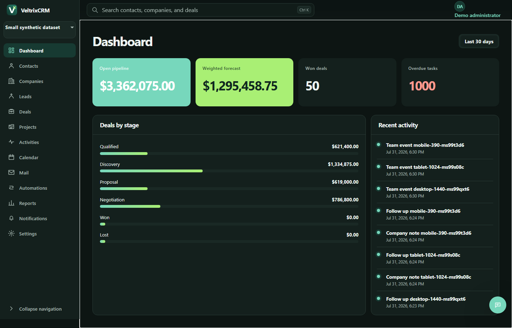
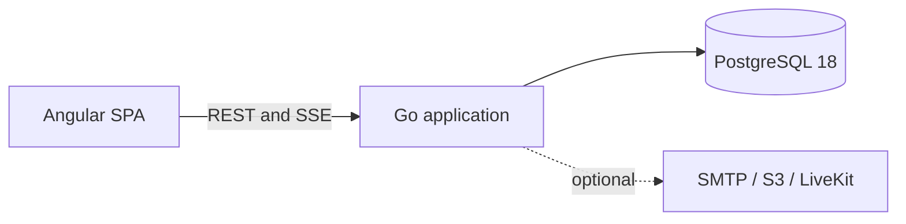

# VeltrixCRM

Self-hosted sales CRM for teams that want to keep customer data and day-to-day sales work in one system.

> **Status: active development.** The product is usable for local evaluation, but interfaces, migrations, and deployment behavior may change before version 1.0. Review the current limitations before using it with production data.

[Русская версия](README.ru.md) · [Current state](docs/STATE.md) · [Roadmap](ROADMAP.md)



## Scope

VeltrixCRM currently brings together:

- contacts, companies, leads, deals, pipelines, tasks, projects, and calendars;
- workspace membership, departments, configurable roles, stage permissions, and TOTP MFA;
- custom fields, tags, saved views, bulk actions, duplicate handling, and CSV import/export;
- list, Kanban, and timeline views for sales work;
- record discussions and team chat with files, reactions, pins, and recorded media;
- optional LiveKit calls and personal IMAP/SMTP mailboxes;
- dashboards, reports, PostgreSQL search, SSE notifications, audit history, automations, API keys, and signed webhooks;
- complete English and Russian interface catalogs and workspace content translations.

The implementation and verification status of each area is recorded in [docs/STATE.md](docs/STATE.md).

## Quick start

Requirements: Docker with Compose v2.

```bash
cp .env.example .env
docker compose up --build
```

PowerShell:

```powershell
Copy-Item .env.example .env
docker compose up --build
```

Open <http://127.0.0.1:8080> and sign in with the local demo account:

```text
Email: admin@demo.local
Password: Demo123!
```

The account is created only when `DEMO_SEED` is enabled. Disable it and replace every example secret outside local development.

## Deployment model



The base profile contains two containers:

1. a non-root Go application serving the API, SSE, workers, and embedded precompressed SPA assets;
2. PostgreSQL for CRM data, row-level security, search, the outbox, and background jobs.

Redis, a message broker, a separate search service, and Node.js at runtime are not required.

For workloads where measured asynchronous fan-out begins to contend with request traffic, the optional `high-throughput` foundation provides confirmed Kafka and RabbitMQ publishers for strict post-commit event pointers. PostgreSQL remains the transaction boundary and source of truth. The current local profile verifies both broker deliveries; broker consumers and workload offloading remain planned and no throughput improvement is claimed yet.

```bash
docker compose --profile high-throughput up --build kafka rabbitmq broker-smoke
```

## Measured profile

The following results come from the documented local benchmark profile. They are not hosting guarantees. Hardware, limits, raw results, and known misses are listed in [docs/PERFORMANCE.md](docs/PERFORMANCE.md).

| Metric                                   |              Result |
| ---------------------------------------- | ------------------: |
| Initial JS + CSS                         |     89.0 KiB Brotli |
| Lighthouse desktop / mobile              |            100 / 94 |
| Lighthouse accessibility                 |                 100 |
| Browser interaction latency              |      48.4 ms median |
| Active DOM                               |           714 nodes |
| Browser heap after the standard scenario |           13.48 MiB |
| Retained heap growth after 20 cycles     |               8.31% |
| 50-VU throughput                         | 222.61 operations/s |
| 50-VU error rate                         |                  0% |
| App / PostgreSQL median peak memory      |  72.14 / 306.10 MiB |
| Kafka/RabbitMQ comparative throughput    |        Not measured |

Targets missed in that profile:

- simulated mobile LCP: 2.77 s against a 2.0 s target;
- read p95: 189.09 ms against a 150 ms target;
- write p95: 283.19 ms against a 250 ms target.

No competitor results are claimed. The repository contains a [manual comparison protocol](docs/COMPETITOR_BENCHMARK_PROTOCOL.md) for authorized measurements.

## Commands

| Command                 | Purpose                                                        |
| ----------------------- | -------------------------------------------------------------- |
| `pnpm bootstrap`        | Install pinned dependencies and generate contracts             |
| `pnpm dev`              | Start the frontend development server                          |
| `pnpm build`            | Build the SPA, bundle report, compressed assets, and Go server |
| `pnpm lint`             | Check frontend, Go, localization, and forbidden imports        |
| `pnpm typecheck`        | Run strict Angular compilation                                 |
| `pnpm test`             | Run Go and Angular unit tests                                  |
| `pnpm test:integration` | Run tests against PostgreSQL                                   |
| `pnpm test:e2e`         | Run Playwright browser and accessibility scenarios             |
| `pnpm seed:small`       | Load the small synthetic dataset                               |
| `pnpm seed:benchmark`   | Load the benchmark dataset                                     |
| `pnpm benchmark`        | Run the three-pass baseline benchmark                          |
| `pnpm check`            | Run the main local quality gate                                |

## Repository map

```text
apps/web/                  Angular SPA
apps/api/                  Go server, SQL, migrations, OpenAPI
packages/contracts/        Generated TypeScript API contracts
packages/i18n/             English source and translated catalogs
packages/product-config/   Central product and brand configuration
benchmarks/                Load and browser scenarios
infra/                     Container build and runtime files
scripts/                   Build, database, and benchmark commands
docs/                      Architecture, operations, security, and evidence
```

## Security

Tenant-owned operations are checked by application authorization and PostgreSQL forced RLS with transaction-local workspace context. Passwords use Argon2id. Session, recovery, and API secrets are stored as hashes. Browser authentication uses HttpOnly cookies and CSRF protection.

Read [SECURITY.md](SECURITY.md) before deployment. The trust boundaries and known risks are documented in [docs/THREAT_MODEL.md](docs/THREAT_MODEL.md).

## Documentation

- [Architecture](docs/ARCHITECTURE.md)
- [Design system](DESIGN.md)
- [Case study](docs/CASE_STUDY.md)
- [Performance report](docs/PERFORMANCE.md)
- [Benchmark methodology](docs/BENCHMARK_METHODOLOGY.md)
- [Localization guide](docs/LOCALIZATION.md)
- [Contribution guide](CONTRIBUTING.md)

## License

[MIT](LICENSE)
