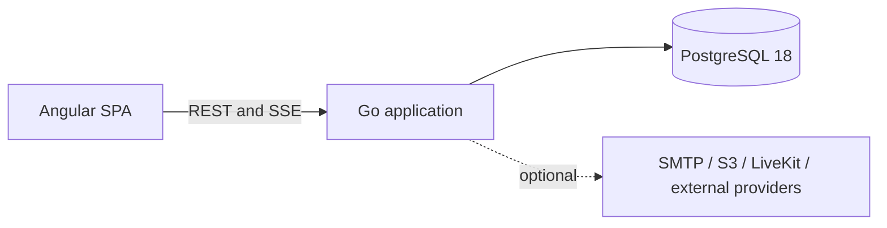

# VeltrixCRM

Self-hosted sales CRM for teams that want one application, one PostgreSQL database, and full control over their data.

VeltrixCRM covers contacts, companies, leads, deals, tasks, projects, calendars, team chat, reporting, automations, mail, and workspace administration. The default deployment runs as two containers: the application and PostgreSQL.

[Русская версия](README.ru.md)


## What is included

- Workspaces, invitations, departments, custom roles, resource permissions, and TOTP MFA.
- Contacts and companies with custom fields, tags, saved views, bulk actions, duplicate handling, CSV import/export, trash, and restore.
- Leads and deals with configurable pipelines, stage permissions, assignments, conversion, and list, Kanban, and Gantt views.
- Tasks and projects with deadlines, responsible users or departments, watchers, files, and discussions.
- Month, week, and day calendars with workspace, department, and personal events plus ICS export.
- Team and record chats with files, reactions, pins, voice/video messages, delivery state, and optional LiveKit calls.
- Personal mailbox connections through IMAP/SMTP with encrypted credentials.
- Dashboard, reports, PostgreSQL full-text/trigram search, notifications over SSE, audit log, automations, API keys, and signed webhooks.
- English and Russian interface catalogs plus workspace content translation.

## Quick start

Requirements: Docker with Compose v2.

```bash
cp .env.example .env
docker compose up --build
```

PowerShell:

```powershell
Copy-Item .env.example .env
docker compose up --build
```

Open <http://127.0.0.1:8080>.

Development credentials:

```text
Email: admin@demo.local
Password: Demo123!
```

The demo account is created only when `DEMO_SEED` is enabled. Disable it and replace all example secrets outside local development.

## Deployment



The application binary serves the API, SSE connections, background workers, and precompressed SPA assets. PostgreSQL stores CRM data, row-level security policies, search documents, outbox events, and background jobs. Redis, a message broker, and a separate search service are not required.

The runtime image is based on `scratch`, runs as a non-root user, contains no Node.js, and uses a read-only filesystem apart from configured upload and temporary mounts.

## Measured profile

These figures come from the documented local test profile, not from a hosted production deployment. Hardware, container limits, raw methodology, misses, and caveats are in [docs/PERFORMANCE.md](docs/PERFORMANCE.md).

| Metric                                   |              Result |
| ---------------------------------------- | ------------------: |
| Initial JS + CSS                         |     89.0 KiB Brotli |
| Lighthouse desktop / mobile              |            100 / 94 |
| Lighthouse accessibility                 |                 100 |
| Browser interaction latency              |      48.4 ms median |
| Active DOM                               |           714 nodes |
| Browser heap after the standard scenario |           13.48 MiB |
| Retained heap growth after 20 cycles     |               8.31% |
| 50-VU throughput                         | 222.61 operations/s |
| 50-VU error rate                         |                  0% |
| App / PostgreSQL median peak memory      |  72.14 / 306.10 MiB |

Known misses in that profile:

- Simulated mobile LCP: 2.77 s against a 2.0 s target.
- Read p95: 189.09 ms against a 150 ms target.
- Write p95: 283.19 ms against a 250 ms target.

No competitor results are claimed. A repeatable comparison procedure is available in [docs/COMPETITOR_BENCHMARK_PROTOCOL.md](docs/COMPETITOR_BENCHMARK_PROTOCOL.md).

## Commands

| Command                 | Purpose                                                        |
| ----------------------- | -------------------------------------------------------------- |
| `pnpm bootstrap`        | Install pinned dependencies and generate contracts             |
| `pnpm dev`              | Start the frontend development server                          |
| `pnpm build`            | Build the SPA, bundle report, compressed assets, and Go server |
| `pnpm lint`             | Run frontend, Go, localization, and forbidden-import checks    |
| `pnpm typecheck`        | Run strict Angular compilation                                 |
| `pnpm test`             | Run Go and Angular unit tests                                  |
| `pnpm test:integration` | Run tests against PostgreSQL                                   |
| `pnpm test:e2e`         | Run Playwright browser and accessibility scenarios             |
| `pnpm seed:small`       | Load the small synthetic dataset                               |
| `pnpm seed:benchmark`   | Load the benchmark dataset                                     |
| `pnpm benchmark`        | Run the three-pass baseline benchmark                          |
| `pnpm check`            | Run the main local quality gate                                |

## Repository layout

```text
apps/web/                  Angular SPA
apps/api/                  Go server, SQL, migrations, OpenAPI
packages/contracts/        TypeScript API contracts
packages/i18n/             English source and translated catalogs
packages/product-config/   Central product configuration
benchmarks/                k6 and browser scenarios
infra/                     Container build and runtime files
scripts/                   Build, database, and benchmark commands
docs/                      Architecture, operations, security, and evidence
```

## Security model

Every tenant-owned operation is checked by application authorization and PostgreSQL forced RLS. Tenant context is transaction-local. Passwords use Argon2id; session, API, and recovery secrets are stored as hashes. Browser authentication uses HttpOnly cookies and CSRF protection. Uploads, webhooks, mailbox connections, and call tokens have separate validation and authorization boundaries.

Read [SECURITY.md](SECURITY.md) before deployment and report vulnerabilities through its private disclosure process. The current trust boundaries are documented in [docs/THREAT_MODEL.md](docs/THREAT_MODEL.md).

## Documentation

- [Architecture](docs/ARCHITECTURE.md)
- [Case study](docs/CASE_STUDY.md)
- [Performance report](docs/PERFORMANCE.md)
- [Benchmark methodology](docs/BENCHMARK_METHODOLOGY.md)
- [Localization guide](docs/LOCALIZATION.md)
- [Current project state](docs/STATE.md)
- [Roadmap](ROADMAP.md)

## License

[MIT](LICENSE)
