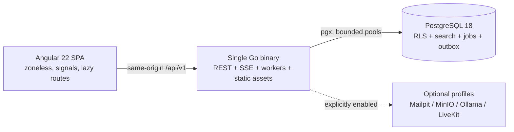

# Resource-conscious, multi-tenant Sales CRM

An open-source Sales CRM designed for small and medium teams that want a responsive multilingual workspace, strong tenant boundaries, and a production profile with only one application container and PostgreSQL.

> The product name, repository identity, supported locales, cookie prefix, and public links are defined in [`packages/product-config/product.json`](packages/product-config/product.json). Change that file and run `pnpm generate:brand` instead of scattering brand strings through the codebase.

[Русская версия](README.ru.md) · [Case study](docs/CASE_STUDY.md) · [Architecture](docs/ARCHITECTURE.md) · [Localization](docs/LOCALIZATION.md) · [Benchmark methodology](docs/BENCHMARK_METHODOLOGY.md) · [Current state](docs/STATE.md)

## Why this project exists

Sales teams need contacts, companies, pipelines, activities, reporting, and automation. Technical owners also need predictable operations and evidence for security and performance claims. This project keeps the required runtime deliberately small: one Go modular monolith serves the REST API, SSE, background work, and an embedded Angular SPA; PostgreSQL provides relational storage, tenant policies, search, outbox, and the job queue.

No Redis, message broker, or search cluster is required by the base profile.

## Product capabilities

- Multi-workspace identity, secure cookie sessions, RBAC, invitations, teams, password recovery, and TOTP MFA.
- Contacts and companies with cursor-driven lists, tags, custom fields, saved views, bulk operations, duplicate merge, trash/restore, and CSV workflows.
- Leads, configurable pipelines/stages, per-stage role overlays, deals, history, line items, and bounded list/Kanban/Gantt loading.
- Tasks, calls, meetings, notes, comments, mentions, reminders, timelines, calendar/ICS, and notifications.
- Projects with task groups and assignments; membership-scoped chat with files, reactions, pins, and optional LiveKit audio/video calls.
- A lazy personal-mail workspace with encrypted per-user credentials, bounded IMAP sync, safe plain-text reading, and SMTP composition.
- PostgreSQL full-text/trigram search, audit history, dashboards, and period-based reporting.
- Transactional outbox, leased PostgreSQL jobs, retry/dead-letter behavior, automations, scoped API keys, and signed webhooks.
- Streaming attachments with local storage by default and an optional S3-compatible adapter.
- English and Russian UI, validation, notification, and email catalogs; per-user and per-workspace locale preferences; and a translation center for workspace-owned content.
- PWA app shell and bounded IndexedDB drafts without copying the CRM database into the browser.

Implementation and verification progress are tracked independently in [`docs/STATE.md`](docs/STATE.md). A listed capability is not a performance or deployment certification.

## Architecture at a glance



The application uses a modular monolith because its workflows benefit from transactions across domain data, audit records, search/outbox events, and jobs. Domain packages remain explicit even though deployment stays compact. See the full [architecture description](docs/ARCHITECTURE.md) and [ADRs](docs/adr/).

## Measured evidence

These values were measured on 2026-07-22. Browser/server performance used application commit `3b26934`; the clean k6 baseline used documentation-only descendant `feaffdd`; bundle size was regenerated from the final working tree after deployment/i18n hardening. They are not presented as a tagged-release or competitor claim. Full environment, method, per-run results, misses, and qualifications are in [the performance report](docs/PERFORMANCE.md).

| Metric | Measured result | Budget / status |
| --- | ---: | --- |
| Initial JS + CSS | 91,746 bytes (89.6 KiB) Brotli | ≤350 KiB — pass |
| Lazy AG Grid Community / optional LiveKit | 166.7 / 114.2 KiB Brotli | both lazy — pass |
| Lighthouse desktop / mobile / accessibility | 100 / 94 / 100 | ≥95 / ≥90 / ≥95 — pass |
| Simulated mobile LCP / CLS | 2.76 s / 0 | ≤2.0 s / ≤0.05 — **LCP miss** |
| Browser interaction / DOM / grid scrolling | 49.1 ms / 710 / 60 FPS | all targets pass |
| Forced-GC heap / 20-cycle retained growth | 13.30 MiB / 8.3% | both targets pass |
| 50-VU throughput / error rate | 222.61 operations/s / 0% | median of 3 clean runs |
| Read / write / search p95 | 189.09 / 283.19 / 176.65 ms | read/write **miss**; search passes |
| Median peak app / PostgreSQL memory | 72.14 / 306.10 MiB | combined 378.24 MiB — pass aspiration |
| Post-E2E idle app memory | 12.61 MiB | ≤96 MiB — pass, single snapshot after 36 min uptime |

No comparison with a commercial or open-source CRM has been measured. The [competitor protocol](docs/COMPETITOR_BENCHMARK_PROTOCOL.md) intentionally starts with `Not measured` values.

## Quick start

Requirements: Docker with Compose v2 and enough local disk for the pinned build images.

```bash
cp .env.example .env
docker compose up --build
```

PowerShell:

```powershell
Copy-Item .env.example .env
docker compose up --build
```

Open <http://127.0.0.1:8080> and use the development-only account:

- Email: `admin@demo.local`
- Password: `Demo123!`

`DEMO_SEED` must be disabled and all sample credentials replaced outside local development. The optional services are not needed for the CRM; enable them explicitly with `--profile mail`, `--profile object-storage`, or `--profile ai-local`.

## Multilingual workflow

English is the source locale and Russian is a required complete locale. UI code uses typed message keys, API behavior uses stable error codes instead of translated strings, and native `Intl` formats dates, numbers, lists, and money.

```bash
pnpm check:i18n
pnpm i18n:extract
pnpm i18n:pseudo
pnpm i18n:add-locale --locale <bcp-47-locale>
```

User preference overrides workspace default, which overrides deployment default. Switching a loaded UI is immediate; workspace-owned templates and content translations have draft/published state, placeholder validation, coverage reporting, and optimistic concurrency. User-entered CRM notes are never silently machine-translated. See the [localization guide](docs/LOCALIZATION.md) and [ADR 0002](docs/adr/0002-localization-contract.md).

## Canonical commands

| Command                 | Purpose                                                  |
| ----------------------- | -------------------------------------------------------- |
| `pnpm bootstrap`        | Install the pinned workspace and regenerate contracts    |
| `pnpm dev`              | Run the Angular development server                       |
| `pnpm build`            | Build the SPA, bundle report, and Go server              |
| `pnpm lint`             | Lint frontend/backend and enforce i18n/forbidden imports |
| `pnpm typecheck`        | Strict frontend compilation                              |
| `pnpm test`             | Go and Angular unit tests                                |
| `pnpm test:integration` | Real-PostgreSQL integration tests                        |
| `pnpm test:e2e`         | Playwright browser and accessibility scenarios           |
| `pnpm seed:small`       | Deterministic small synthetic dataset                    |
| `pnpm seed:benchmark`   | Deterministic benchmark dataset                          |
| `pnpm benchmark`        | Three baseline k6 runs and Docker stats                  |
| `pnpm check`            | Main local quality gate                                  |

## Production profile

| Component  | Responsibility                                        | Default limit in Compose |
| ---------- | ----------------------------------------------------- | -----------------------: |
| `app`      | API, SSE, bounded workers, embedded precompressed SPA |         0.5 CPU / 128 MB |
| `postgres` | Durable data, RLS, search, queue, outbox              |         0.5 CPU / 384 MB |

The final image is a non-root `scratch` image. It contains the statically built Go server, healthcheck, CA certificates, generated brand config, and precompressed web assets; it does not contain Node.js. The filesystem is read-only except for explicit upload and temporary mounts.

## Screenshots

Portfolio screenshots must come from Playwright against the running application. They have not yet been captured in the repository, so no mock images are shown here. The required views, viewport matrix, naming rules, and capture command are documented in [`docs/screenshots/README.md`](docs/screenshots/README.md).

| Required view            | Repository artifact |
| ------------------------ | ------------------- |
| Dashboard                | Not captured        |
| Contacts grid            | Not captured        |
| Deal pipeline            | Not captured        |
| Contact/company timeline | Not captured        |
| Reports                  | Not captured        |
| Dark theme               | Not captured        |

## Repository map

```text
apps/web/                 Angular SPA
apps/api/                 Go modular monolith, SQL, migrations, OpenAPI
packages/contracts/       Generated TypeScript API contracts
packages/i18n/            Source and translated message catalogs
packages/product-config/  Central product identity
benchmarks/               k6, Playwright, and raw-result location
infra/                    Container helpers
scripts/                  Cross-platform build, i18n, and operations scripts
docs/                     Architecture, case study, threat model, and evidence
.github/                  CI, security, and contribution automation
```

## Security summary

The design combines object-level application authorization with forced PostgreSQL RLS. Tenant context is transaction-local; runtime and dispatcher database roles are separate. Passwords use Argon2id, session/API/recovery secrets are stored as hashes, browser authentication uses HttpOnly cookies plus CSRF defenses, and upload/webhook paths have explicit validation boundaries.

This is a security model, not a certification. Read the [security policy](SECURITY.md), [threat model](docs/THREAT_MODEL.md), and current verification record before deploying. Report vulnerabilities privately as described in `SECURITY.md`.

## Roadmap and project status

The staged plan is in [`ROADMAP.md`](ROADMAP.md). Release readiness depends on clean-clone Compose, end-to-end, Lighthouse, load/resource, security-scan, and screenshot evidence. Until those gates are recorded, treat the repository as pre-release engineering work.

## AI-assisted development disclosure

The initial repository was produced with AI assistance under the preserved [master requirements](docs/MASTER_PROMPT.md), with architecture, performance, security, UX, QA, and implementation tasks reviewed in parallel. The project does not publish hidden reasoning or invented history. Verifiable actions, checks, fixes, and assisted file groups are listed in [`docs/AI_BUILD_LOG.md`](docs/AI_BUILD_LOG.md).

## License

[MIT](LICENSE). Production and optional dependencies retain their own licenses; see [`docs/DEPENDENCIES.md`](docs/DEPENDENCIES.md).
