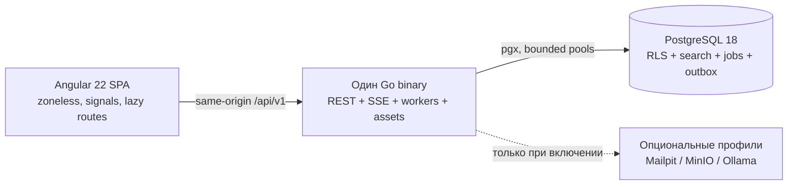

# Ресурсно-эффективная мультитенантная Sales CRM

Open-source Sales CRM для небольших и средних команд, которым нужны отзывчивый мультиязычный интерфейс, строгие границы арендаторов и production-профиль всего из одного контейнера приложения и PostgreSQL.

> Имя продукта и репозитория, поддерживаемые языки, префикс cookie и публичные ссылки задаются в [`packages/product-config/product.json`](packages/product-config/product.json). Для переименования измените этот файл и выполните `pnpm generate:brand` — брендовые строки не должны размножаться по исходному коду.

[English](README.md) · [Case study](docs/CASE_STUDY.ru.md) · [Архитектура](docs/ARCHITECTURE.ru.md) · [Мультиязычность](docs/LOCALIZATION.ru.md) · [Методика benchmark](docs/BENCHMARK_METHODOLOGY.md) · [Текущее состояние](docs/STATE.md)

## Зачем нужен проект

Sales-командам нужны контакты, компании, воронки, активности, отчёты и автоматизация. Техническому владельцу дополнительно нужны предсказуемая эксплуатация и проверяемые доказательства security/performance-заявлений. Поэтому обязательный runtime намеренно мал: один модульный Go-монолит обслуживает REST API, SSE, фоновые задачи и встроенную Angular SPA, а PostgreSQL отвечает за данные, tenant policies, поиск, outbox и очередь задач.

В базовой конфигурации не нужны Redis, message broker и отдельный поисковый кластер.

## Возможности

- Несколько workspaces, безопасные cookie-сессии, RBAC, приглашения, команды, восстановление пароля и TOTP MFA.
- Контакты и компании: cursor pagination, теги, custom fields, saved views, bulk operations, поиск дублей, merge, корзина/restore и CSV-процессы.
- Лиды, настраиваемые pipelines/stages, сделки, история стадий, line items и ограниченная загрузка Kanban.
- Задачи, звонки, встречи, заметки, комментарии, упоминания, напоминания, timeline, календарь/ICS и уведомления.
- Full-text/trigram-поиск PostgreSQL, аудит, dashboard и отчёты по периоду.
- Transactional outbox, PostgreSQL job queue с lease/retry/dead-letter, automation, scoped API keys и подписанные webhooks.
- Потоковые вложения: local storage по умолчанию и optional S3-compatible adapter.
- Английский и русский каталоги UI, validation, notifications и email; настройки языка пользователя/workspace; Translation Center для контента workspace.
- PWA app shell и ограниченные IndexedDB drafts без копирования CRM-базы в браузер.

Фактическая готовность и результаты проверок ведутся отдельно в [`docs/STATE.md`](docs/STATE.md). Наличие кода функции не означает сертификацию deployment или performance.

## Архитектура



Modular monolith выбран потому, что CRM-сценариям полезны общие транзакции для доменных данных, аудита, search/outbox events и jobs. При компактном deployment границы модулей остаются явными. Подробности: [архитектура](docs/ARCHITECTURE.ru.md) и [ADR](docs/adr/).

## Фактические измерения

Bundle-отчёт был сформирован 21 июля 2026 года. После него рабочее дерево изменялось, поэтому перед релизом нужна новая сборка; таблица не выдаёт исторический артефакт за release-final результат.

| Метрика                                 |         Зафиксированное значение |                                                              Budget | Evidence / статус                                                                                                     |
| --------------------------------------- | -------------------------------: | ------------------------------------------------------------------: | --------------------------------------------------------------------------------------------------------------------- |
| Initial JS + CSS                        |   86 727 bytes (84,7 KiB) Brotli |                                                    target ≤ 350 KiB | [`benchmarks/results/bundle-report.json`](benchmarks/results/bundle-report.json), историческая сборка рабочего дерева |
| Lazy AG Grid chunk                      | 158 063 bytes (154,4 KiB) Brotli | документированное lazy-исключение; обычный feature target ≤ 200 KiB | Тот же bundle artifact; route-lazy                                                                                    |
| Крупнейший обычный lazy feature chunk   |   26 466 bytes (25,8 KiB) Brotli |                                                    target ≤ 200 KiB | Тот же bundle artifact                                                                                                |
| Ссылки на внешние шрифты                |        scanner не нашёл ни одной |                                                                   0 | Тот же bundle artifact                                                                                                |
| Lighthouse desktop/mobile/accessibility |                     Not measured |                                                     ≥95 / ≥90 / ≥95 | Нужен запущенный production build                                                                                     |
| API latency/throughput/error rate       |                     Not measured |                                                        См. методику | Завершённых k6 summary нет                                                                                            |
| RSS/CPU приложения и PostgreSQL         |                     Not measured |                            idle app RSS ≤96 MB; общий target 512 MB | Docker metrics artifact отсутствует                                                                                   |

Сравнение с коммерческими или open-source CRM не проводилось. [Протокол сравнения](docs/COMPETITOR_BENCHMARK_PROTOCOL.md) намеренно содержит `Not measured`, пока нет воспроизводимых данных.

## Быстрый запуск

Нужны Docker и Compose v2.

```bash
cp .env.example .env
docker compose up --build
```

PowerShell:

```powershell
Copy-Item .env.example .env
docker compose up --build
```

Откройте <http://localhost:8080>. Development-only аккаунт:

- Email: `admin@demo.local`
- Password: `Demo123!`

За пределами локальной разработки отключите `DEMO_SEED` и замените все демонстрационные credentials. Опциональные сервисы CRM не требуются: профили `mail`, `object-storage` и `ai-local` включаются явно.

## Мультиязычность и перевод

English — source locale, русский — обязательный полный перевод. UI использует типизированные message keys, API-логика опирается на стабильные error codes, а даты, числа, списки и деньги форматируются через native `Intl`.

```bash
pnpm check:i18n
pnpm i18n:extract
pnpm i18n:pseudo
pnpm i18n:add-locale --locale <bcp-47-locale>
```

Приоритет языка: пользователь → workspace → deployment default. Загруженный UI переключается сразу. Для переводимого контента workspace предусмотрены draft/published state, проверка placeholders, coverage и optimistic concurrency. Пользовательские заметки и CRM-контент никогда не переводятся автоматически без явного действия. См. [руководство по мультиязычности](docs/LOCALIZATION.ru.md) и [ADR 0002](docs/adr/0002-localization-contract.md).

## Основные команды

| Команда                 | Назначение                                                |
| ----------------------- | --------------------------------------------------------- |
| `pnpm bootstrap`        | Установить lockfile-зависимости и сгенерировать contracts |
| `pnpm dev`              | Запустить Angular development server                      |
| `pnpm build`            | Собрать SPA, bundle report и Go server                    |
| `pnpm lint`             | Проверить frontend/backend, i18n и запрещённые imports    |
| `pnpm typecheck`        | Строгая frontend-компиляция                               |
| `pnpm test`             | Unit tests Go и Angular                                   |
| `pnpm test:integration` | Integration tests с реальным PostgreSQL                   |
| `pnpm test:e2e`         | Playwright browser/accessibility scenarios                |
| `pnpm seed:small`       | Детерминированный small synthetic dataset                 |
| `pnpm seed:benchmark`   | Детерминированный benchmark dataset                       |
| `pnpm benchmark`        | Три baseline k6 запуска и Docker stats                    |
| `pnpm check`            | Основной локальный quality gate                           |

## Production profile

| Компонент  | Ответственность                                       | Default Compose limit |
| ---------- | ----------------------------------------------------- | --------------------: |
| `app`      | API, SSE, bounded workers, embedded precompressed SPA |      0,5 CPU / 128 MB |
| `postgres` | Данные, RLS, поиск, queue, outbox                     |      0,5 CPU / 384 MB |

Итоговый образ основан на `scratch`, запускается от non-root пользователя и содержит статически собранный Go server, healthcheck, CA certificates, generated brand config и предварительно сжатые web assets. Node.js в runtime отсутствует. Файловая система read-only, кроме явных upload/tmp mounts.

## Screenshots

Portfolio screenshots должны быть сняты Playwright из реально запущенного приложения. Сейчас их нет в репозитории, поэтому макеты не подставляются. Viewports, имена и команда захвата описаны в [`docs/screenshots/README.md`](docs/screenshots/README.md).

| Требуемый экран          | Artifact     |
| ------------------------ | ------------ |
| Dashboard                | Not captured |
| Contacts grid            | Not captured |
| Deal pipeline            | Not captured |
| Contact/company timeline | Not captured |
| Reports                  | Not captured |
| Dark theme               | Not captured |

## Структура репозитория

```text
apps/web/                 Angular SPA
apps/api/                 Go monolith, SQL, migrations, OpenAPI
packages/contracts/       Generated TypeScript API contracts
packages/i18n/            Source/translated message catalogs
packages/product-config/  Централизованная конфигурация продукта
benchmarks/               k6, Playwright и raw results
infra/                    Container helpers
scripts/                  Build, i18n и operational scripts
docs/                     Architecture, case study, threat model, evidence
.github/                  CI, security и contribution automation
```

## Security

Object-level authorization в приложении дополняется forced PostgreSQL RLS. Tenant context существует только внутри транзакции; runtime и dispatcher используют разные DB roles. Пароли хэшируются Argon2id, session/API/recovery secrets хранятся только как hashes, browser auth использует HttpOnly cookies и CSRF-защиту, а upload/webhook paths имеют отдельные validation boundaries.

Это модель защиты, а не сертификация. До deployment прочитайте [security policy](SECURITY.md), [threat model](docs/THREAT_MODEL.md) и текущие результаты проверок. Уязвимости следует сообщать приватно по инструкции в `SECURITY.md`.

## Roadmap и статус

Этапы находятся в [`ROADMAP.md`](ROADMAP.md). Готовность релиза требует clean-clone Compose, E2E, Lighthouse, load/resource, security-scan и screenshot evidence. Пока эти gates не зафиксированы, репозиторий имеет pre-release статус.

## AI-assisted development

Начальный репозиторий создан с AI assistance по сохранённым [master requirements](docs/MASTER_PROMPT.md); архитектура, performance, security, UX, QA и implementation анализировались параллельно. Проект не публикует скрытые рассуждения и не выдумывает историю. Проверяемые действия, команды, исправления и группы файлов перечислены в [`docs/AI_BUILD_LOG.md`](docs/AI_BUILD_LOG.md).

## Лицензия

[MIT](LICENSE). У production и optional dependencies собственные лицензии; см. [`docs/DEPENDENCIES.md`](docs/DEPENDENCIES.md).
