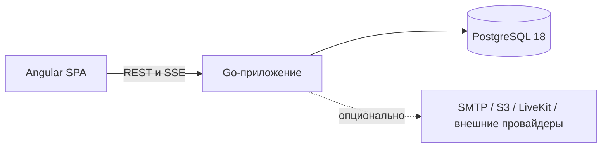

# VeltrixCRM

Самостоятельно разворачиваемая CRM для отдела продаж: одно приложение, одна база PostgreSQL и полный контроль над данными.

VeltrixCRM объединяет контакты, компании, лиды, сделки, задачи, проекты, календарь, командные чаты, отчёты, автоматизации, почту и управление рабочим пространством. Для базового запуска нужны только два контейнера: приложение и PostgreSQL.

[English version](README.md)


## Возможности

- Рабочие пространства, приглашения, отделы, настраиваемые роли, права на сущности и TOTP MFA.
- Контакты и компании с дополнительными полями, тегами, сохранёнными представлениями, групповыми действиями, поиском дублей, CSV-импортом и экспортом, корзиной и восстановлением.
- Лиды и сделки с настраиваемыми воронками, правами на стадии, назначениями, конвертацией и режимами «Список», «Канбан» и «Гант».
- Задачи и проекты со сроками, ответственными пользователями или отделами, наблюдателями, файлами и обсуждениями.
- Календарь на месяц, неделю и день с общими, групповыми и личными событиями, а также экспортом ICS.
- Командные чаты и обсуждения записей с файлами, реакциями, закреплением, голосовыми и видеосообщениями, статусом доставки и опциональными звонками через LiveKit.
- Подключение личной корпоративной почты по IMAP/SMTP с шифрованием учётных данных.
- Главная с показателями, отчёты, полнотекстовый и нечёткий поиск PostgreSQL, уведомления через SSE, аудит, автоматизации, API-ключи и подписанные webhooks.
- Полные английские и русские каталоги интерфейса и перевод контента рабочего пространства.

## Быстрый запуск

Потребуется Docker с Compose v2.

```bash
cp .env.example .env
docker compose up --build
```

PowerShell:

```powershell
Copy-Item .env.example .env
docker compose up --build
```

Откройте <http://127.0.0.1:8080>.

Данные для локальной разработки:

```text
Email: admin@demo.local
Password: Demo123!
```

Демонстрационный аккаунт создаётся только при включённом `DEMO_SEED`. За пределами локальной среды отключите его и замените все примерные секреты.

## Развёртывание



Один исполняемый файл обслуживает API, SSE-соединения, фоновые задачи и предварительно сжатые файлы SPA. PostgreSQL хранит данные CRM, политики строковой безопасности, поисковые документы, outbox-события и очередь заданий. Redis, брокер сообщений и отдельный поисковый сервис не требуются.

Runtime-образ основан на `scratch`, работает без root-прав, не содержит Node.js и использует read-only файловую систему, кроме настроенных каталогов загрузок и временных файлов.

## Измеренный профиль

Результаты получены в зафиксированном локальном сценарии, а не в публичном production-развёртывании. Оборудование, лимиты контейнеров, методика, отклонения и оговорки приведены в [docs/PERFORMANCE.md](docs/PERFORMANCE.md).

| Метрика                                      |          Результат |
| -------------------------------------------- | -----------------: |
| Начальные JS + CSS                           |    89,0 KiB Brotli |
| Lighthouse desktop / mobile                  |           100 / 94 |
| Lighthouse accessibility                     |                100 |
| Задержка контрольного действия               |   48,4 мс, медиана |
| Активный DOM                                 |          714 узлов |
| Browser heap после стандартного сценария     |          13,48 MiB |
| Рост retained heap после 20 циклов           |              8,31% |
| Пропускная способность при 50 VU             |  222,61 операции/с |
| Доля ошибок при 50 VU                        |                 0% |
| Медианный пик памяти приложения / PostgreSQL | 72,14 / 306,10 MiB |

Цели, не достигнутые в этом профиле:

- Mobile LCP в эмуляции: 2,77 с при цели 2,0 с.
- Read p95: 189,09 мс при цели 150 мс.
- Write p95: 283,19 мс при цели 250 мс.

Сравнение с другими CRM не проводилось. В [протоколе сравнения](docs/COMPETITOR_BENCHMARK_PROTOCOL.md) описана воспроизводимая ручная процедура.

## Команды

| Команда                 | Назначение                                                |
| ----------------------- | --------------------------------------------------------- |
| `pnpm bootstrap`        | Установить закреплённые зависимости и создать контракты   |
| `pnpm dev`              | Запустить frontend-сервер разработки                      |
| `pnpm build`            | Собрать SPA, отчёт по размеру, сжатые файлы и Go-сервер   |
| `pnpm lint`             | Проверить frontend, Go, локализацию и запрещённые импорты |
| `pnpm typecheck`        | Выполнить строгую компиляцию Angular                      |
| `pnpm test`             | Запустить unit-тесты Go и Angular                         |
| `pnpm test:integration` | Запустить тесты с PostgreSQL                              |
| `pnpm test:e2e`         | Запустить браузерные и accessibility-сценарии Playwright  |
| `pnpm seed:small`       | Загрузить малый синтетический набор данных                |
| `pnpm seed:benchmark`   | Загрузить набор данных для benchmark                      |
| `pnpm benchmark`        | Выполнить три прогона базового benchmark                  |
| `pnpm check`            | Запустить основной локальный набор проверок               |

## Структура репозитория

```text
apps/web/                  Angular SPA
apps/api/                  Go-сервер, SQL, миграции, OpenAPI
packages/contracts/        TypeScript-контракты API
packages/i18n/             Исходный английский и переведённые каталоги
packages/product-config/   Централизованная конфигурация продукта
benchmarks/                Сценарии k6 и браузера
infra/                     Сборка контейнеров и runtime
scripts/                   Сборка, база данных и benchmark
docs/                      Архитектура, эксплуатация, безопасность и измерения
```

## Безопасность

Каждая операция с данными рабочего пространства проверяется приложением и PostgreSQL forced RLS. Контекст арендатора действует только внутри транзакции. Пароли хэшируются Argon2id; секреты сессий, API и восстановления хранятся в виде хэшей. Авторизация в браузере использует HttpOnly cookies и CSRF-защиту. Для загрузок, webhooks, почтовых подключений и токенов звонков действуют отдельные проверки.

Перед развёртыванием прочитайте [SECURITY.md](SECURITY.md). Уязвимости следует отправлять приватно по указанной там процедуре. Границы доверия описаны в [docs/THREAT_MODEL.md](docs/THREAT_MODEL.md).

## Документация

- [Архитектура](docs/ARCHITECTURE.ru.md)
- [Разбор проекта](docs/CASE_STUDY.ru.md)
- [Отчёт о производительности](docs/PERFORMANCE.md)
- [Методика benchmark](docs/BENCHMARK_METHODOLOGY.md)
- [Руководство по локализации](docs/LOCALIZATION.ru.md)
- [Текущее состояние проекта](docs/STATE.md)
- [План развития](ROADMAP.md)

## Лицензия

[MIT](LICENSE)
