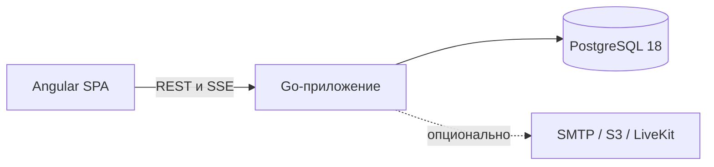

# VeltrixCRM

Самостоятельно разворачиваемая CRM для отделов продаж, которым важно хранить клиентские данные и вести ежедневную работу в одной системе.

> **Статус: активная разработка.** Продукт подходит для локальной оценки, но до версии 1.0 интерфейсы, миграции и порядок развёртывания могут меняться. Перед использованием с рабочими данными ознакомьтесь с текущими ограничениями.

[English version](README.md) · [Текущее состояние](docs/STATE.md) · [План развития](ROADMAP.md)


## Что входит в проект

VeltrixCRM объединяет:

- контакты, компании, лиды, сделки, воронки, задачи, проекты и календарь;
- участников рабочего пространства, отделы, настраиваемые роли, права на стадии и TOTP MFA;
- дополнительные поля, теги, сохранённые представления, групповые действия, поиск дублей и импорт/экспорт CSV;
- списки, канбан и временные представления для работы с продажами;
- обсуждения записей и командные чаты с файлами, реакциями, закреплением и записанными медиа;
- опциональные звонки через LiveKit и личные почтовые ящики по IMAP/SMTP;
- главную с показателями, отчёты, поиск PostgreSQL, SSE-уведомления, аудит, автоматизации, API-ключи и подписанные webhooks;
- полные английский и русский каталоги интерфейса и переводы содержимого рабочего пространства.

Фактический статус реализации и проверок по каждому направлению указан в [docs/STATE.md](docs/STATE.md).

## Быстрый запуск

Требуется Docker с Compose v2.

```bash
cp .env.example .env
docker compose up --build
```

PowerShell:

```powershell
Copy-Item .env.example .env
docker compose up --build
```

Откройте <http://127.0.0.1:8080> и войдите с локальной демонстрационной учётной записью:

```text
Email: admin@demo.local
Password: Demo123!
```

Учётная запись создаётся только при включённом `DEMO_SEED`. За пределами локальной разработки отключите его и замените все примерные секреты.

## Схема развёртывания



Базовый профиль состоит из двух контейнеров:

1. Go-приложение без root-прав, которое обслуживает API, SSE, фоновые задачи и встроенные предварительно сжатые файлы SPA;
2. PostgreSQL для данных CRM, строковой безопасности, поиска, outbox и очереди фоновых заданий.

Redis, брокер сообщений, отдельный поисковый сервис и Node.js в runtime не требуются.

Для нагрузок, при которых измеренный асинхронный fan-out начинает конкурировать с API за ресурсы, заложен опциональный профиль `high-throughput`. Сейчас он реализует подтверждённую публикацию строгих post-commit указателей в Kafka и RabbitMQ; PostgreSQL остаётся транзакционной границей и источником истины. Consumers и перенос рабочих нагрузок на брокеры ещё запланированы, поэтому прирост производительности пока не заявляется.

```bash
docker compose --profile high-throughput up --build kafka rabbitmq broker-smoke
```

## Измеренный профиль

Ниже приведены результаты зафиксированного локального сценария. Это не гарантия для произвольного сервера. Оборудование, лимиты, исходные результаты и отклонения указаны в [docs/PERFORMANCE.md](docs/PERFORMANCE.md).

| Метрика                                         |          Результат |
| ----------------------------------------------- | -----------------: |
| Начальные JS + CSS                              |    92,9 KiB Brotli |
| Lighthouse desktop / mobile                     |           100 / 94 |
| Lighthouse accessibility                        |                100 |
| Задержка контрольного действия                  |   48,4 мс, медиана |
| Активный DOM                                    |          714 узлов |
| Browser heap после стандартного сценария        |          13,48 MiB |
| Рост retained heap после 20 циклов              |              8,31% |
| Пропускная способность при 50 VU                |  222,61 операции/с |
| Доля ошибок при 50 VU                           |                 0% |
| Медианный пик памяти приложения / PostgreSQL    | 72,14 / 306,10 MiB |
| Сравнительная производительность Kafka/RabbitMQ |        Не измерена |

Цели, не достигнутые в этом профиле:

- mobile LCP в эмуляции: 2,77 с при цели 2,0 с;
- read p95: 189,09 мс при цели 150 мс;
- write p95: 283,19 мс при цели 250 мс.

Сравнение с другими CRM не проводилось. Для разрешённых измерений в репозитории есть [ручной протокол сравнения](docs/COMPETITOR_BENCHMARK_PROTOCOL.md).

## Команды

| Команда                 | Назначение                                                |
| ----------------------- | --------------------------------------------------------- |
| `pnpm bootstrap`        | Установить закреплённые зависимости и создать контракты   |
| `pnpm dev`              | Запустить frontend-сервер разработки                      |
| `pnpm build`            | Собрать SPA, отчёт о размере, сжатые файлы и Go-сервер    |
| `pnpm lint`             | Проверить frontend, Go, локализацию и запрещённые импорты |
| `pnpm typecheck`        | Выполнить строгую компиляцию Angular                      |
| `pnpm test`             | Запустить unit-тесты Go и Angular                         |
| `pnpm test:integration` | Запустить тесты с PostgreSQL                              |
| `pnpm test:e2e`         | Запустить браузерные и accessibility-сценарии Playwright  |
| `pnpm seed:small`       | Загрузить малый синтетический набор данных                |
| `pnpm seed:benchmark`   | Загрузить benchmark-набор данных                          |
| `pnpm benchmark`        | Выполнить базовое измерение в три прохода                 |
| `pnpm check`            | Выполнить основную локальную проверку                     |

## Структура репозитория

```text
apps/web/                  Angular SPA
apps/api/                  Go-сервер, SQL, миграции, OpenAPI
packages/contracts/        Сгенерированные TypeScript-контракты API
packages/i18n/             Английский источник и переведённые каталоги
packages/product-config/   Централизованные настройки продукта и бренда
benchmarks/                Нагрузочные и браузерные сценарии
infra/                     Сборка контейнера и runtime
scripts/                   Команды сборки, базы данных и измерений
docs/                      Архитектура, эксплуатация, безопасность и результаты
```

## Безопасность

Операции с данными рабочего пространства проверяются авторизацией приложения и принудительной RLS PostgreSQL с контекстом внутри транзакции. Для паролей используется Argon2id. Секреты сессий, восстановления и API хранятся в виде хэшей. Браузерная авторизация использует HttpOnly cookies и CSRF-защиту.

Перед развёртыванием прочитайте [SECURITY.md](SECURITY.md). Границы доверия и известные риски описаны в [docs/THREAT_MODEL.md](docs/THREAT_MODEL.md).

## Документация

- [Архитектура](docs/ARCHITECTURE.ru.md)
- [Дизайн-система](DESIGN.md)
- [Разбор проекта](docs/CASE_STUDY.ru.md)
- [Отчёт о производительности](docs/PERFORMANCE.md)
- [Методика измерений](docs/BENCHMARK_METHODOLOGY.md)
- [Руководство по локализации](docs/LOCALIZATION.ru.md)
- [Правила участия](CONTRIBUTING.md)

## Лицензия

[MIT](LICENSE)
