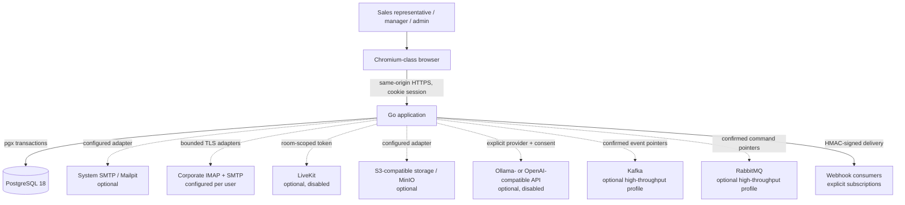
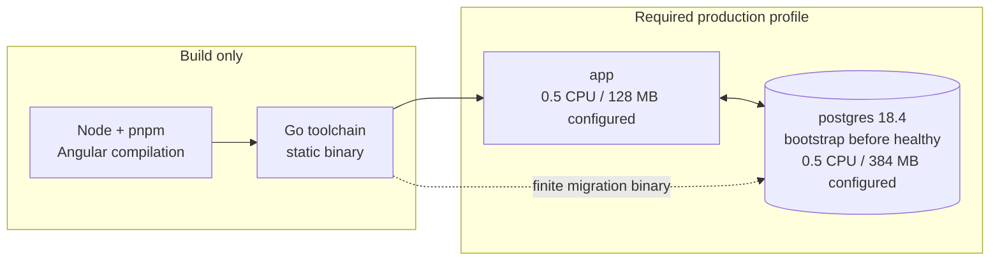
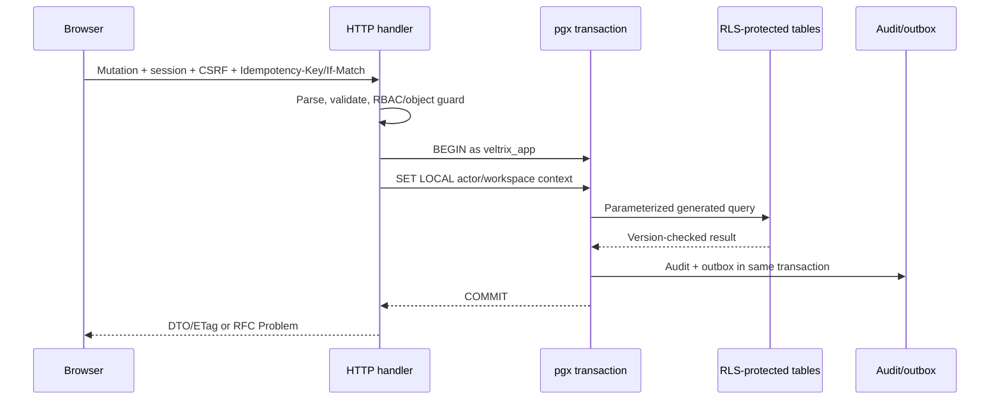
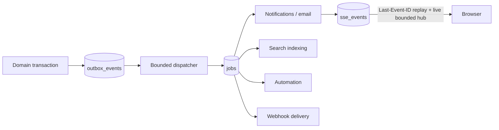

# Architecture

Status: implementation architecture, 2026-07-22. Verification status and measured evidence are maintained in [`STATE.md`](STATE.md) and [`PERFORMANCE.md`](PERFORMANCE.md).

## Architectural drivers

The system is a multi-tenant Sales CRM optimized for four simultaneous constraints:

1. Daily interactions should remain responsive as tenant datasets grow.
2. The base deployment should have the fewest practical moving parts.
3. Tenant isolation must survive an application-level authorization mistake.
4. Performance and security statements must be reproducible rather than promotional.

These constraints favor a modular monolith, cursor-driven APIs, a lazy Angular SPA, and deliberate use of PostgreSQL capabilities over separate infrastructure services.

## System context

The base runtime contains only `app` and `postgres`. Dotted integrations are optional and must not be required for readiness.

## Production runtime

One statically compiled Go binary supports five command families:

- `serve`: REST, SSE, embedded SPA, and bounded background work in the default single-node profile;
- `worker`: the same job/outbox machinery as a separately scalable process;
- `broker-smoke`: a bounded integration check that requires Kafka and RabbitMQ publisher confirmations;
- `bootstrap`: a finite deployment step that uses migration credentials, validates migration checksums, applies migrations, and optionally creates the local development seed;
- other operator commands such as deterministic bulk seeding.

The custom PostgreSQL image is still based on the pinned `postgres:18.4-bookworm` image. Its startup wrapper waits for the official image to finish database initialization, runs the finite `bootstrap` command as the local `postgres` user, performs a clean fast shutdown, scrubs finite bootstrap variables, then replaces itself with the steady PostgreSQL process as PID 1. Database health requires that final listener. The application encryption/provider secrets are never passed to PostgreSQL. Therefore the base profile creates exactly `app` and `postgres`, while the request-serving process receives no database administrator URL, role password, automatic-migration flag, or demo password.

The production image uses `scratch`, runs as UID/GID 65532, drops capabilities, and is read-only except for explicit upload and temporary mounts. The Angular build is copied into the Go embed tree after gzip/Brotli precompression. Fingerprinted assets can be cached immutably; SPA routes fall back to `index.html`; `/api` paths never use that fallback.

Configured limits are not the same as measured resource use. See [`PERFORMANCE.md`](PERFORMANCE.md).

## Backend modular monolith

The source is organized by business capability under `apps/api/internal`. A module owns its validation, service behavior, SQL queries, and tests. Cross-module behavior uses explicit interfaces or platform events rather than reaching into another module's private implementation.

| Module          | Responsibility                                                        |
| --------------- | --------------------------------------------------------------------- |
| `identity`      | Password/session lifecycle, reset, MFA, recovery codes                |
| `tenancy`       | Workspaces, memberships, teams, roles, invitations, locale policy     |
| `customers`     | Contacts, companies, tags, custom fields, saved views, CSV, merge     |
| `sales`         | Leads, pipelines, stages, deals, history, participants and line items |
| `activities`    | Tasks, calls, meetings, notes, comments, reminders, calendar/ICS      |
| `automation`    | Rules, condition evaluation, execution fences and retry state         |
| `notifications` | In-app/SSE notifications and localized email delivery                 |
| `reporting`     | Dashboard/read models and bounded period aggregations                 |
| `search`        | Tenant-scoped search documents, FTS and trigram queries               |
| `files`         | Attachment policy and local/S3-compatible storage ports               |
| `mailbox`       | Personal encrypted mail accounts, bounded IMAP cache and SMTP send    |
| `integrations`  | API keys, webhooks, signing, replay and delivery lifecycle            |
| `audit`         | Append-oriented security and business audit events                    |
| `localization`  | Workspace content resources/translations and email rendering          |
| `platform`      | Database, IDs, HTTP problems, pagination, jobs, outbox, web assets    |
| `app`           | Composition root, route wiring, middleware, transaction boundary      |

`chi` is used only for HTTP routing, `pgx` for database access, and generated `sqlc` code for typed query parameters/results. The project does not use an ORM.

## API and transaction boundary

The public contract is OpenAPI 3.1 under `/api/v1`. Problem responses use RFC Problem Details plus stable `code`, `params`, `fieldErrors`, and `requestId`. Clients localize the stable code; server-side authorization never depends on translated prose.

Mutation handlers apply bounded request bodies, validate input, authorize the actor and permission, then perform database work inside an application-role transaction. Duplicate-prone operations accept an idempotency key. Mutable resources expose `version`/ETag and require `If-Match` where concurrent edits matter. Large collections use opaque cursor pagination.

## Tenant isolation

Every tenant-owned row includes `workspace_id`; high-volume compound indexes start with it. Isolation has two independent layers:

1. Route, service, permission, and object guards bind the authenticated actor to the workspace.
2. PostgreSQL enables and forces RLS. `veltrix_app` is non-superuser and `NOBYPASSRLS`; policies compare `workspace_id` to `security.current_workspace_id()`.

The application sets actor and workspace variables with `SET LOCAL` after beginning a transaction. This prevents tenant state from surviving a commit/rollback or leaking through a pooled connection. A separate `veltrix_dispatcher` role can claim global outbox/jobs but has deliberately narrow grants. Schema objects are owned by a `NOLOGIN` migration role. Indexed global search uses another narrow `NOLOGIN` owner that must independently prove active membership and entity/stage/audience visibility before returning a document; it is not a general privileged request path.

Negative integration tests are expected to cover read, search, insert, update, delete, and pooled-connection context leakage with real PostgreSQL. See [ADR 0003](adr/0003-tenant-isolation-and-database-roles.md) and current test evidence in [`STATE.md`](STATE.md).

## Persistence model

- IDs are UUIDv7 for index-friendly global uniqueness.
- Timestamps are UTC `timestamptz` values.
- Money is integer minor units plus an ISO 4217 currency code.
- Soft-deleted customer records retain auditability and can be restored.
- Custom-field definitions are typed; JSONB values are size/type validated and selectively indexed.
- `search_documents` carries normalized text, `tsvector`, tenant/entity identity, display metadata, and safe plain-text snippets.
- Audit events are append-oriented and omit credentials, tokens, and raw secrets.

PostgreSQL extensions are limited to `pg_trgm` and built-in full-text capabilities required by the search design.

## Outbox, jobs, and real-time delivery

Domain state and an outbox event commit atomically. The dispatcher claims outbox records and fans them into durable, idempotent jobs for search, notifications, automations, and webhook delivery. Workers use `FOR UPDATE SKIP LOCKED`, leases, bounded batches/concurrency, handler deadlines, exponential backoff, maximum attempts, and a dead state.

The optional high-throughput foundation currently publishes strict, PII-free outbox pointers after the database transaction commits and verifies broker acknowledgements. PostgreSQL remains authoritative for CRM state, retries, idempotency, and SSE replay; broker delivery is at least once. Kafka projection consumers and RabbitMQ workload consumers are the next gated increment and are not presented as implemented offloading. The base profile starts neither broker. See [ADR 0021](adr/0021-optional-high-throughput-brokers.md) and the [broker benchmark protocol](BROKER_BENCHMARK.md).

SSE is authorized per workspace, sends heartbeat comments, supports bounded durable replay, and releases clients on cancellation. Slow clients cannot create an unbounded in-memory queue. See [ADR 0004](adr/0004-postgresql-outbox-jobs-and-sse.md).

## Frontend architecture

The Angular 22 application is standalone, strict, zoneless, and uses `ChangeDetectionStrategy.OnPush`. Route-level lazy loading is the primary code-split boundary. Feature-scoped signal stores keep server pages, request state, optimistic mutations, and bounded caches local to the feature; RxJS is reserved for cancellation, SSE, and Angular integration.

AG Grid Community is registered selectively inside complex lazy list routes. It uses server-driven pagination/infinite loading and never receives the entire benchmark dataset. CDK supplies drag/drop and accessibility behavior. Charts are small semantic SVG components instead of a general chart dependency. No icon font or remote web font is requested.

The PWA stores only the shell, recent metadata, and explicit drafts. It is not a full offline replica or conflict-resolution system. See [ADR 0005](adr/0005-frontend-payload-and-static-assets.md).

## Localization architecture

There are two intentionally separate translation systems:

- **Product catalogs** in `packages/i18n`: source-controlled, typed, split by namespace, and checked for missing/extra keys and placeholder parity. English is source; Russian is release-required.
- **Workspace content translations** in PostgreSQL: tenant-owned resources with locale, draft/published status, coverage, placeholder validation, version/ETag, and fallback policy.

Locale resolution is `user preference → workspace default → deployment default`. System notifications and email store template keys and typed parameters, then render for the recipient. User-authored CRM content remains unchanged. Adding a locale is scripted and pseudo-localization exposes layout assumptions before a translation is complete.

## Security boundaries

- Same-origin deployment keeps CORS disabled by default.
- HttpOnly session cookies, CSRF cookie/header checks, SameSite policy, secure production cookies, rotation, and expiration protect browser sessions.
- Argon2id protects passwords; random session, API-key, and recovery secrets are stored only as hashes.
- Permission middleware and object checks precede data access; RLS is defense in depth.
- Security headers include CSP, `nosniff`, referrer, and permissions policies; HSTS is enabled only for a correct TLS deployment.
- Uploads are streamed through size/MIME/name checks and an antivirus hook; local storage uses rooted filesystem access. Webhook targets are screened against SSRF, signed with HMAC, retried, and logged without secrets.
- Optional external AI is disabled by default and must have provider configuration, explicit PII consent, timeout/cancellation, rate limiting, and audit.

The detailed attack analysis and residual risks are in [`THREAT_MODEL.md`](THREAT_MODEL.md).

## Scalability and trade-offs

The base profile prioritizes operational simplicity over independently scalable services. Horizontal growth can separate the worker command and add application replicas behind a TLS proxy, while PostgreSQL remains the coordination point. This works only while database connection, write, WAL, and query budgets remain healthy; the project does not claim infinite scale.

Using PostgreSQL for search and queues avoids operational components but couples their load to transactional data. Bounded workers, tenant-first indexes, query plans, and benchmark profiles are therefore release gates. If evidence later shows a hard database bottleneck, an ADR must justify any new infrastructure rather than adding it preemptively.

## Source-of-truth map

| Concern                                | Canonical source                                                      |
| -------------------------------------- | --------------------------------------------------------------------- |
| Product identity and supported locales | `packages/product-config/product.json`                                |
| HTTP contract                          | `apps/api/openapi/openapi.yaml`                                       |
| Database schema and RLS                | `apps/api/migrations/`                                                |
| Typed SQL                              | `apps/api/queries/` and generated `internal/platform/database/dbgen/` |
| UI/system translations                 | `packages/i18n/`                                                      |
| Deployment                             | `Dockerfile`, `compose.yaml`, `.env.example`                          |
| Performance procedure/results          | `docs/BENCHMARK_METHODOLOGY.md`, `docs/PERFORMANCE.md`, `benchmarks/` |
| Current verified state                 | `docs/STATE.md`                                                       |

## Decision records

- [ADR 0001 — modular monolith and two-container runtime](adr/0001-modular-monolith-and-runtime.md)
- [ADR 0002 — localization contract](adr/0002-localization-contract.md)
- [ADR 0003 — tenant isolation and database roles](adr/0003-tenant-isolation-and-database-roles.md)
- [ADR 0004 — PostgreSQL outbox, jobs, and SSE](adr/0004-postgresql-outbox-jobs-and-sse.md)
- [ADR 0005 — frontend payload and static assets](adr/0005-frontend-payload-and-static-assets.md)
- [ADR 0006 — optional AI boundary](adr/0006-optional-ai-provider-boundary.md)
