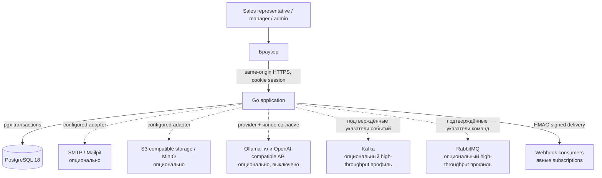
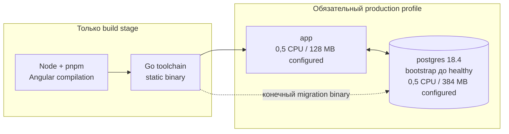
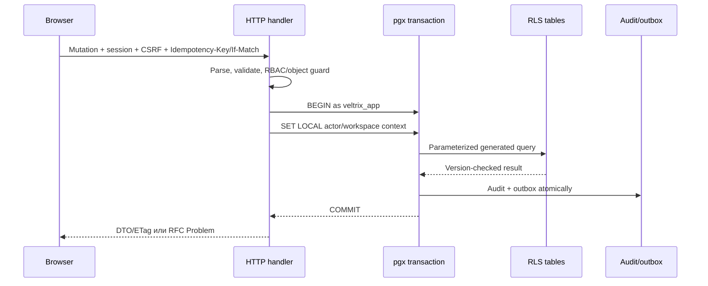
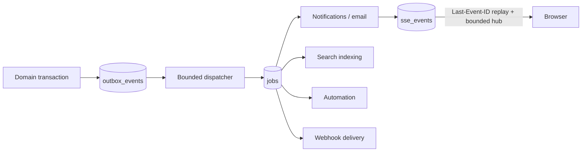

# Архитектура

Статус: архитектура реализации на 2026-07-21. Фактические результаты проверок и измерений находятся в [`STATE.md`](STATE.md) и [`PERFORMANCE.md`](PERFORMANCE.md).

## Архитектурные драйверы

Система — мультитенантная Sales CRM с четырьмя одновременными ограничениями:

1. Повседневные действия должны оставаться отзывчивыми при росте данных tenant.
2. Базовый deployment должен содержать минимум практически необходимых компонентов.
3. Tenant isolation должна выдерживать ошибку application-level authorization.
4. Performance/security-заявления должны воспроизводиться, а не быть рекламными обещаниями.

Этим ограничениям соответствуют modular monolith, cursor API, lazy Angular SPA и осознанное использование возможностей PostgreSQL вместо отдельных infrastructure services.

## Контекст системы

Базовый runtime состоит только из `app` и `postgres`. Пунктирные интеграции не участвуют в обязательном readiness path.

## Production runtime

Один статически собранный Go binary поддерживает:

- `serve`: REST, SSE, embedded SPA и bounded background work для single-node профиля;
- `worker`: тот же job/outbox runtime отдельным масштабируемым процессом;
- `bootstrap`: конечный deployment-шаг, который проверяет checksum миграций, применяет их и при необходимости создаёт локальный development seed;
- другие operational commands для migrations и детерминированного seed.

Пользовательский PostgreSQL image остаётся производным от закреплённого `postgres:18.4-bookworm`. Wrapper дожидается официальной инициализации БД, запускает ограниченный `bootstrap` от локального пользователя `postgres`, выполняет чистый fast shutdown, удаляет bootstrap-переменные и заменяет себя постоянным процессом PostgreSQL как PID 1. Healthcheck проверяет уже финальный listener. Master key приложения и provider secrets никогда не передаются PostgreSQL. Поэтому обязательный профиль содержит ровно `app` и `postgres`, а serving-процесс не получает admin URL, пароль роли, auto-migrate flag или demo password.

Production image основан на `scratch`, работает как UID/GID 65532, лишён capabilities и read-only, кроме явных upload/tmp mounts. Angular build копируется в Go embed после gzip/Brotli precompression. Fingerprinted assets получают immutable cache, SPA routes используют fallback на `index.html`, а `/api` никогда не попадает в этот fallback.

Configured limits не являются измеренным потреблением. См. [`PERFORMANCE.md`](PERFORMANCE.md).

## Backend modular monolith

Исходный код разделён по business capabilities в `apps/api/internal`. Модуль владеет validation, service behavior, SQL queries и tests. Межмодульное взаимодействие идёт через явные интерфейсы или platform events, а не через доступ к private implementation другого модуля.

| Модуль          | Ответственность                                                    |
| --------------- | ------------------------------------------------------------------ |
| `identity`      | Password/session lifecycle, reset, MFA, recovery codes             |
| `tenancy`       | Workspaces, memberships, teams, roles, invitations, locale policy  |
| `customers`     | Contacts, companies, tags, custom fields, saved views, CSV, merge  |
| `sales`         | Leads, pipelines, stages, deals, history, participants, line items |
| `activities`    | Tasks, calls, meetings, notes, comments, reminders, calendar/ICS   |
| `automation`    | Rules, conditions, execution fences, retry state                   |
| `notifications` | In-app/SSE notifications и localized email                         |
| `reporting`     | Dashboard/read models и bounded period aggregations                |
| `search`        | Tenant-scoped documents, FTS и trigram queries                     |
| `files`         | Attachment policy, local/S3-compatible storage ports               |
| `integrations`  | API keys, webhooks, signing, replay, delivery lifecycle            |
| `audit`         | Append-oriented security/business events                           |
| `localization`  | Workspace content translations и email rendering                   |
| `platform`      | DB, IDs, HTTP problems, pagination, jobs, outbox, web assets       |
| `app`           | Composition root, routes, middleware, transaction boundary         |

`chi` используется только как router, `pgx` — для DB, generated `sqlc` — для type-safe SQL. ORM отсутствует.

## API и транзакция

Публичный OpenAPI 3.1 contract расположен под `/api/v1`. RFC Problem Details дополнены стабильными `code`, `params`, `fieldErrors` и `requestId`. Клиент переводит code; серверная authorization не зависит от локализованного текста.

Mutation handler ограничивает request body, валидирует данные, проверяет actor/permission и выполняет SQL внутри app-role transaction. Для duplicate-prone операций используется idempotency key. Mutable resources используют `version`/ETag и `If-Match`. Большие коллекции используют opaque cursor pagination.

## Tenant isolation

У каждой tenant-owned строки есть `workspace_id`; compound indexes для больших таблиц начинаются с него. Два независимых слоя:

1. Route/service/permission/object guards связывают authenticated actor с workspace.
2. PostgreSQL включает и принудительно применяет RLS. `veltrix_app` — non-superuser и `NOBYPASSRLS`; policies сравнивают `workspace_id` с `security.current_workspace_id()`.

Actor и workspace variables устанавливаются через `SET LOCAL` только после начала transaction. Поэтому контекст исчезает при commit/rollback и не протекает через pooled connection. Отдельная роль `veltrix_dispatcher` может глобально claim outbox/jobs, но имеет узкие grants. Schema objects принадлежат `NOLOGIN` migration role.

Negative integration tests должны доказывать изоляцию read/search/insert/update/delete и отсутствие утечки context на реальном PostgreSQL. См. [ADR 0003](adr/0003-tenant-isolation-and-database-roles.md) и актуальный evidence в [`STATE.md`](STATE.md).

## Модель хранения

- UUIDv7 для index-friendly уникальных ID.
- UTC `timestamptz` для времени.
- Деньги в integer minor units и ISO 4217 currency.
- Soft delete для customer records с auditability и restore.
- Типизированные custom-field definitions; JSONB values валидируются по типу/размеру и индексируются только для нужных запросов.
- `search_documents`: normalized text, `tsvector`, tenant/entity identity, display metadata и безопасные plain-text snippets.
- Audit events append-oriented и не содержат credentials, tokens или raw secrets.

Для поиска применяются `pg_trgm` и встроенный PostgreSQL full-text search.

## Outbox, jobs и real-time

Domain state и outbox event коммитятся одной транзакцией. Dispatcher переводит outbox в durable idempotent jobs для search, notifications, automation и webhooks. Worker использует `FOR UPDATE SKIP LOCKED`, lease, bounded batch/concurrency, handler deadline, exponential backoff, maximum attempts и dead state.

Опциональная high-throughput основа сейчас публикует строгие PII-free указатели outbox после database commit и проверяет подтверждение брокера. PostgreSQL остаётся источником истины, retry scheduler, idempotency ledger и хранилищем SSE replay; доставка выполняется как минимум один раз. Kafka consumers для проекций и RabbitMQ consumers для рабочих задач являются следующим этапом и не выдаются за уже работающий offload. Базовый профиль не запускает брокеры. Решение описано в [ADR 0021](adr/0021-optional-high-throughput-brokers.md), методика измерений — в [BROKER_BENCHMARK.md](BROKER_BENCHMARK.md).

SSE авторизован по workspace, посылает heartbeat, поддерживает bounded durable replay и освобождает client при cancellation. Медленный client не создаёт неограниченную очередь. См. [ADR 0004](adr/0004-postgresql-outbox-jobs-and-sse.md).

## Frontend

Angular 22 SPA использует standalone components, strict TypeScript, zoneless mode и `ChangeDetectionStrategy.OnPush`. Основная граница code splitting — lazy routes. Feature-scoped signal stores держат server pages, request state, optimistic mutations и bounded caches локально; RxJS используется для cancellation, SSE и Angular integration.

AG Grid Community селективно зарегистрирован только в сложных lazy list routes. Он получает серверные страницы/infinite data и не загружает benchmark dataset целиком. CDK отвечает за drag/drop и accessibility behavior. Графики — небольшие semantic SVG components вместо общей chart library. Icon fonts и remote fonts отсутствуют.

PWA хранит shell, recent metadata и explicit drafts, но не является full offline replica. См. [ADR 0005](adr/0005-frontend-payload-and-static-assets.md).

## Мультиязычная архитектура

Две независимые системы перевода:

- **Product catalogs** в `packages/i18n`: source-controlled, typed, namespace-split; CI проверяет missing/extra keys и placeholder parity. English — source, русский обязателен для release.
- **Workspace content translations** в PostgreSQL: tenant resources с locale, draft/published, coverage, placeholders, version/ETag и fallback policy.

Locale resolution: `user preference → workspace default → deployment default`. Notifications/email хранят template key и typed params, затем рендерятся для recipient. User-authored CRM content остаётся исходным. Скрипт добавления языка и pseudo-localization позволяют проверить layout до готового перевода.

## Security boundaries

- Same-origin deployment, CORS по умолчанию выключен.
- HttpOnly session cookies, CSRF cookie/header, SameSite, Secure в production, rotation/expiration.
- Argon2id для passwords; session/API/recovery secrets хранятся только как hashes.
- Permission/object checks до SQL и RLS defense in depth.
- CSP, `nosniff`, referrer и permissions policies; HSTS только при корректном TLS.
- Streaming uploads с size/MIME/name validation и antivirus hook; rooted local filesystem. Webhook targets проходят SSRF screening, HMAC signing, retry и safe logging.
- External AI выключен по умолчанию и требует provider configuration, явного PII consent, timeout/cancellation, rate limit и audit.

Подробности и residual risks: [`THREAT_MODEL.md`](THREAT_MODEL.md).

## Масштабирование и trade-offs

Base profile выбирает простую эксплуатацию вместо независимо масштабируемых services. При росте worker можно вынести отдельной командой, а app replicas поставить за TLS proxy. PostgreSQL остаётся coordination point. Это допустимо, пока connection/write/WAL/query budgets здоровы; бесконечная масштабируемость не заявляется.

Search и queue в PostgreSQL связывают их нагрузку с transactional data. Поэтому bounded workers, tenant-first indexes, query plans и benchmark profiles — release gates. Новый infrastructure component может появиться только после измеренного bottleneck и отдельного ADR.

## Карта source of truth

| Область                    | Канонический источник                                              |
| -------------------------- | ------------------------------------------------------------------ |
| Product identity и locales | `packages/product-config/product.json`                             |
| HTTP contract              | `apps/api/openapi/openapi.yaml`                                    |
| Schema и RLS               | `apps/api/migrations/`                                             |
| Typed SQL                  | `apps/api/queries/`, generated `internal/platform/database/dbgen/` |
| UI/system translations     | `packages/i18n/`                                                   |
| Deployment                 | `Dockerfile`, `compose.yaml`, `.env.example`                       |
| Performance method/results | `BENCHMARK_METHODOLOGY.md`, `PERFORMANCE.md`, `benchmarks/`        |
| Текущее verified state     | `STATE.md`                                                         |

## ADR

- [ADR 0001 — modular monolith и two-container runtime](adr/0001-modular-monolith-and-runtime.md)
- [ADR 0002 — localization contract](adr/0002-localization-contract.md)
- [ADR 0003 — tenant isolation и database roles](adr/0003-tenant-isolation-and-database-roles.md)
- [ADR 0004 — PostgreSQL outbox, jobs и SSE](adr/0004-postgresql-outbox-jobs-and-sse.md)
- [ADR 0005 — frontend payload и static assets](adr/0005-frontend-payload-and-static-assets.md)
- [ADR 0006 — optional AI boundary](adr/0006-optional-ai-provider-boundary.md)
