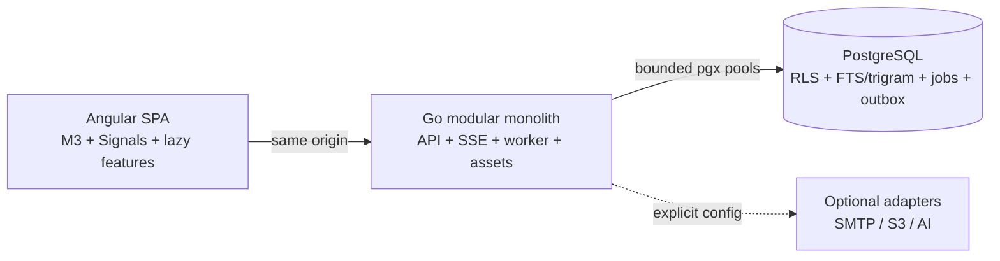

# Case study: a compact, evidence-led Sales CRM

Date: 2026-07-21  
Status: pre-release engineering case study; measured claims are limited to the artifacts cited below.

## 1. Problem

A useful Sales CRM quickly accumulates domain depth: identity, workspaces, customer data, pipelines, activity history, reporting, imports, automations, notifications, integrations, and audit. A conventional response is to add an independent cache, search cluster, broker, workflow service, and frontend state platform. That can be justified at large scale, but it raises the operational floor for smaller teams.

The project asks a narrower question: how much real CRM capability can fit in a carefully bounded Angular + Go + PostgreSQL system while keeping tenant boundaries and performance claims independently testable?

## 2. Constraints

- Angular 22 SPA with no SSR, no `zone.js`, strict TypeScript, signals, Material/CDK/Aria, and route-level lazy loading.
- A Go modular monolith using `net/http`, `chi`, `pgx`, generated SQL, and OpenAPI 3.1.
- PostgreSQL 18 as the only required stateful service.
- One production binary for API, SSE, background work, and precompressed SPA assets.
- App-level tenant guards plus forced PostgreSQL RLS.
- RU and EN as first-class locales, including system messages and a maintainable content-translation workflow.
- Honest bundle, browser, load, and resource evidence; `Not measured` instead of estimated numbers.
- A 0.5 CPU / 128 MB app and 0.5 CPU / 384 MB database baseline profile.

## 3. Working hypotheses

The design started with hypotheses, not conclusions:

1. A focused Sales CRM can use PostgreSQL for durable queueing and tenant-scoped search without requiring Redis, Kafka, or Elasticsearch in the base profile.
2. A zoneless, lazy Angular application with scoped signals can stay within a 350 KiB initial Brotli target even with Material and a lazy Community grid.
3. Application authorization plus transaction-local forced RLS provides a stronger tenant boundary than either layer alone.
4. One deployable process can serve small and medium teams if caches, pools, jobs, uploads, SSE, and list sizes are bounded.

Only repeatable measurements can accept or reject the performance parts of those hypotheses.

## 4. Architecture

The browser requests bounded pages and stage slices. The server validates and authorizes each operation, establishes actor/workspace context inside a transaction, and uses generated parameterized SQL. Mutations can atomically write domain state, audit metadata, and an outbox event. A bounded dispatcher creates durable jobs; SSE delivers tenant events with reconnect and replay.

The detailed component and trust-boundary view is in [`ARCHITECTURE.md`](ARCHITECTURE.md).

## 5. Why a modular monolith

CRM features frequently meet at a transaction boundary. Creating a contact may update a search document, create an audit event, emit automation input, and notify a subscriber. In a modular monolith, the durable intent for all of those effects can commit with the domain change without distributed transactions.

This choice reduces deployment and observability surface, makes local reproduction practical, and keeps idle overhead low in principle. It also creates discipline requirements: modules must own their tables/queries, the composition root must remain explicit, and cross-module dependencies must be reviewed. A shared database is not permission to create a giant service.

## 6. Why no Redis, Kafka, or Elasticsearch in the base profile

- PostgreSQL already provides transactionally consistent rows, `SKIP LOCKED`, advisory/row locking semantics, retry timestamps, full-text search, `pg_trgm`, and durable indexes.
- The expected first deployment tier benefits more from fewer failure modes than from independent horizontal scaling of every subsystem.
- Search, outbox, and queue state remain included in ordinary backup/restore procedures.

The trade-off is shared database load. Queue contention, index bloat, WAL pressure, and expensive search can affect CRUD if not bounded. The benchmark dataset, tenant-first indexes, query-plan review, connection caps, and the option to run the same worker as a separate command are mitigations—not proof that the design fits every scale.

## 7. Why Angular is zoneless

Zoneless Angular makes change propagation explicit. Standalone OnPush components consume signals and computed values; feature stores own only their route's state. This avoids a global store containing CRM records and reduces incidental work caused by unrelated asynchronous events.

RxJS remains where it earns its complexity: cancellable queries, SSE, and Angular API integration. The UI also uses tracked `@for`, route lazy loading, selective Material/CDK imports, bounded server pages, and IndexedDB only for drafts/recent metadata.

Zoneless mode does not make an application fast by itself. Browser timing, DOM size, heap retention, and interaction latency remain release measurements.

## 8. Controlling the frontend payload

- The shell and route features compile separately.
- AG Grid Community is imported only by lazy list features, with only used modules registered; Enterprise is forbidden by an automated import/dependency check.
- Charts are small semantic SVG components; there is no general chart library in the production dependency graph.
- System fonts and inline/selective SVG avoid remote font and icon-font requests.
- Fingerprinted output is precompressed with gzip and Brotli before embedding in Go.
- Angular budgets and an independent emitted-asset scanner fail the hard initial threshold and flag oversized ordinary lazy features.

The recorded 2026-07-21 artifact reports 86,727 bytes (84.7 KiB) initial JS+CSS Brotli and a 158,063-byte (154.4 KiB) lazy AG Grid chunk. Because code changed after that artifact, these are historical working-tree measurements, not release-final values. Evidence: `benchmarks/results/bundle-report.json` and [`PERFORMANCE.md`](PERFORMANCE.md).

## 9. Tenant isolation

The application first authenticates a hash-only session token, resolves workspace membership, and checks a permission/object policy. It then starts a `veltrix_app` transaction and applies actor/workspace IDs with `SET LOCAL`. Forced RLS compares every tenant row to that context. The runtime role is non-superuser and cannot bypass RLS; schema ownership belongs to a non-login role. A separate dispatcher role has narrow global access only to work coordination tables.

This prevents pooled connections from retaining tenant context and makes an omitted `WHERE workspace_id = ...` insufficient to expose another tenant. Negative real-PostgreSQL tests are the acceptance evidence; their current command/result belongs in [`STATE.md`](STATE.md), not in marketing copy.

## 10. Outbox and jobs

Domain mutations record outbox intent in the same transaction. The dispatcher claims events in bounded batches and creates jobs for search, notifications, automations, and webhooks. Job claims use `FOR UPDATE SKIP LOCKED`, an owner/lease deadline, attempt limits, exponential retry, and dead-letter state. Handlers have deadlines and idempotency fences.

SSE uses durable event rows for bounded `Last-Event-ID` replay and an in-process hub for live delivery. A client heartbeat supports proxy timeouts; cancellation removes the client; backpressure remains bounded.

## 11. Localization as a product contract

Localization was not deferred to a final copy pass. English source catalogs and required Russian catalogs are namespace-split and checked for exact key/placeholder parity. Generated key types prevent arbitrary strings in UI code. Stable API problem codes allow clients to localize without coupling business logic to prose.

For content that workspace administrators control, a separate PostgreSQL model tracks source text, locale, draft/published state, placeholders, version, and coverage. Locale preference resolves user → workspace → deployment. User-authored notes and customer data are never silently machine-translated.

## 12. Benchmark methodology and actual results

The repository defines deterministic datasets and a k6 workload with a one-minute warm-up followed by at least five measured minutes. Baseline uses 50 virtual users; stretch uses 100. The operation mix is 65% list/dashboard reads, 17% global search, 10% detail reads, and 8% idempotent contact writes. Three runs are the default, and the report uses medians rather than selecting the best run.

Actual state at the date of this case study:

| Evidence                         | Result                                                         |
| -------------------------------- | -------------------------------------------------------------- |
| Initial/lazy bundle artifact     | Recorded; see section 8 and [`PERFORMANCE.md`](PERFORMANCE.md) |
| Lighthouse and Web Vitals        | Not measured                                                   |
| Browser heap/retention/table FPS | Not measured                                                   |
| k6 baseline/stretch              | Not measured                                                   |
| Container RSS/CPU/startup        | Not measured                                                   |
| Competitor data                  | Not measured                                                   |

The complete protocol and metadata requirements are in [`BENCHMARK_METHODOLOGY.md`](BENCHMARK_METHODOLOGY.md).

## 13. Decisions that failed or needed correction

The build record includes concrete corrections rather than a fictional straight-line success story:

- An early workspace RLS policy had an incorrectly correlated membership expression, and workspace creation established tenant context too late for `INSERT ... RETURNING`. A security-hardening migration and transaction-order correction were introduced; the final integration result must be recorded after rerun.
- An initial PL/pgSQL custom-field validation expression used an invalid `IF CASE` shape. It was corrected to a parenthesized boolean `CASE` and migrations were reapplied on real PostgreSQL.
- Docker Desktop's WSL engine returned an HTTP 500 with an RCU stall on the build machine. The implementation did not claim container metrics; real PostgreSQL integration work continued against a pinned local PostgreSQL 18.4 test server. Production-like Compose remains a required final gate.
- The bundle report was generated before later frontend feature edits. It is retained as a dated measurement but explicitly cannot serve as the final release number.

These points are implementation evidence and open verification obligations, not product weaknesses hidden from readers.

## 14. Trade-offs

| Decision                | Benefit                                       | Cost / limit                                              |
| ----------------------- | --------------------------------------------- | --------------------------------------------------------- |
| Modular monolith        | Atomic workflows, simple deployment           | Strong module discipline; process deploys together        |
| PostgreSQL queue/search | Fewer services and backups                    | Shared DB resource contention                             |
| Cookie same-origin auth | No browser token storage                      | CSRF and proxy/TLS configuration must be correct          |
| Forced RLS              | Defense against missing tenant predicates     | Transaction context and role grants are security-critical |
| Lazy AG Grid Community  | Rich bounded lists without initial cost       | Large route chunk and careful module/version management   |
| Custom SVG charts       | Small payload and accessible semantics        | Fewer advanced chart features                             |
| Runtime RU/EN catalogs  | Immediate preference switch                   | Translation parity becomes a release gate                 |
| PWA drafts only         | Useful resilience with bounded complexity     | No general offline write synchronization                  |
| Optional AI boundary    | No baseline dependency or silent PII transfer | Capabilities unavailable until configured/consented       |

## 15. What Codex did

Codex worked directly in the local repository from the supplied master brief. It created the architecture and phased plan, coordinated independent architecture/performance/security/UX/QA and implementation tasks, installed and used the requested product-marketing and design-engineering skills, implemented code and tests, and prepared deployment, benchmark, security, localization, and portfolio assets.

This statement describes assisted work, not independent human authorship or production certification. The verifiable file groups and checks are listed in [`AI_BUILD_LOG.md`](AI_BUILD_LOG.md).

## 16. What was engineering-verified

Verification is deliberately separated by evidence type:

- A dated bundle artifact exists and records compressed emitted assets.
- Source includes Go/Angular unit tests, real-PostgreSQL integration tests, Playwright flows, accessibility scans, k6 scenarios, and CI definitions.
- The migration/schema and runtime role model can be inspected directly.
- A test or workflow file existing does not mean it passed; authoritative successful commands are recorded in [`STATE.md`](STATE.md).
- No Lighthouse, k6, competitor, screenshot, Docker resource, or production-container result is claimed without an artifact.

## 17. Known limitations

- Docker recovered after a local WSL-engine failure; production-like Compose and resource verification still need final retained artifacts.
- Release-final frontend bundles must be rebuilt after current source changes.
- Lighthouse, browser memory/retention/FPS, k6, and container resource budgets remain unmeasured.
- Real portfolio screenshots have not been captured.
- GitHub Actions have been defined but not proven by a hosted workflow run.
- Optional AI is a security boundary and adapter contract, not a required baseline feature; provider behavior must be tested against a configured deployment.
- The project has no customer research, customer logos, testimonials, or measured competitor results.

## 18. Roadmap

The next evidence-bearing milestone is a clean production build on a clean PostgreSQL database, the small deterministic seed, the core Playwright journey with a clean console, portfolio screenshots, Lighthouse/bundle analysis, three baseline k6 runs with Docker stats, and dependency/container security scans. Critical/high independent review findings must be fixed and affected checks rerun before a release tag.

See [`ROADMAP.md`](../ROADMAP.md), [`DEMO_SCRIPT.md`](DEMO_SCRIPT.md), and [`GITHUB_SETUP.md`](GITHUB_SETUP.md).
