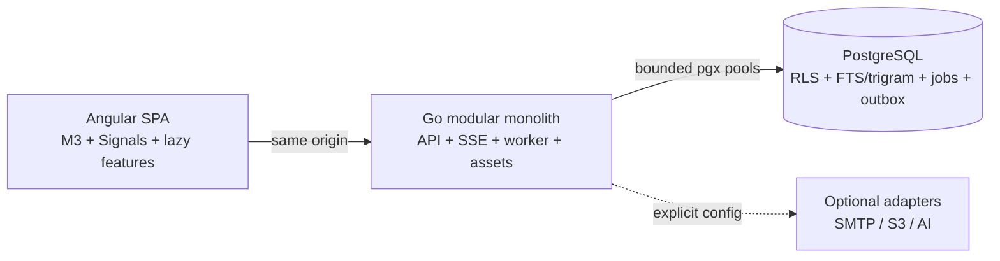

# Case study: компактная Sales CRM с проверяемыми заявлениями

Дата: 2026-07-21  
Статус: pre-release engineering case study; измеренные заявления ограничены указанными artifacts.

## 1. Проблема

Полезная Sales CRM быстро обрастает глубиной: identity, workspaces, customer data, pipelines, activity history, reporting, imports, automation, notifications, integrations и audit. Типичный ответ — добавить отдельные cache, search cluster, broker, workflow service и frontend state platform. На большом масштабе это бывает оправдано, но для небольшой команды повышает минимальную стоимость эксплуатации.

Проект проверяет более узкую гипотезу: сколько реальной CRM-функциональности можно разместить в аккуратно ограниченной системе Angular + Go + PostgreSQL, сохранив tenant boundaries и независимо проверяемые performance claims?

## 2. Ограничения

- Angular 22 SPA без SSR и `zone.js`: strict TypeScript, signals, Material/CDK/Aria, lazy routes.
- Go modular monolith на `net/http`, `chi`, `pgx`, generated SQL и OpenAPI 3.1.
- PostgreSQL 18 — единственный обязательный stateful service.
- Один production binary для API, SSE, background work и precompressed SPA.
- Application tenant guards плюс forced PostgreSQL RLS.
- RU/EN с первого релиза, включая system messages и удобный workflow перевода контента.
- Честные bundle/browser/load/resource evidence; `Not measured` вместо оценок.
- Baseline: app 0,5 CPU / 128 MB и DB 0,5 CPU / 384 MB.

## 3. Рабочие гипотезы

Проект начинался с гипотез, а не выводов:

1. Focused Sales CRM может использовать PostgreSQL для durable queue и tenant search без Redis, Kafka и Elasticsearch в base profile.
2. Zoneless lazy Angular со scoped signals способен уложиться в 350 KiB initial Brotli даже с Material и lazy Community grid.
3. Application authorization вместе с transaction-local forced RLS сильнее любого из слоёв по отдельности.
4. Один deployable process может обслуживать small/medium teams, если cache, pool, jobs, uploads, SSE и lists строго bounded.

Performance-часть этих гипотез принимается только после повторяемых измерений.

## 4. Архитектура

Браузер запрашивает ограниченные страницы и stage slices. Сервер валидирует/авторизует операцию, задаёт actor/workspace context внутри transaction и выполняет generated parameterized SQL. Mutation атомарно записывает domain state, audit и outbox event. Bounded dispatcher создаёт durable jobs; SSE доставляет tenant events с reconnect/replay.

Полное описание: [`ARCHITECTURE.ru.md`](ARCHITECTURE.ru.md).

## 5. Почему modular monolith

CRM-функции часто сходятся на transaction boundary. Создание контакта может потребовать search update, audit event, automation input и notification. В modular monolith durable intent для этих эффектов коммитится вместе с domain mutation без distributed transaction.

Это уменьшает deployment/observability surface, упрощает локальное воспроизведение и в принципе снижает idle overhead. Цена — дисциплина: модуль владеет своими tables/queries, composition root остаётся явным, cross-module dependencies проходят review. Общая DB не разрешает giant service.

## 6. Почему в base profile нет Redis, Kafka и Elasticsearch

- PostgreSQL уже предоставляет consistent rows, `SKIP LOCKED`, locking, retry timestamps, full-text search, `pg_trgm` и durable indexes.
- Первому deployment tier важнее меньше failure modes, чем независимое horizontal scaling каждого subsystem.
- Search/outbox/queue входят в обычный backup/restore.

Trade-off — общая нагрузка DB. Queue contention, index bloat, WAL pressure и дорогой search могут повлиять на CRUD. Tenant-first indexes, connection caps, benchmark dataset/query plans и возможность отдельного `worker` — mitigations, но не доказательство пригодности для любого scale.

## 7. Почему Angular работает zoneless

Zoneless mode делает change propagation явным. Standalone OnPush components читают signals/computed; feature store владеет только state своего route. Глобального store со всеми CRM records нет.

RxJS остаётся для cancellable queries, SSE и Angular integration. Дополнительно применяются tracked `@for`, lazy routes, selective Material/CDK imports, server pages и IndexedDB только для drafts/recent metadata.

Сам по себе zoneless не гарантирует скорость: browser timing, DOM size, heap retention и interaction latency остаются release measurements.

## 8. Контроль frontend payload

- Shell и features компилируются отдельно.
- AG Grid Community загружается только на lazy list routes; регистрируются используемые modules, Enterprise запрещён automated check.
- Charts — небольшие semantic SVG components, общей chart library нет.
- System fonts и selective SVG исключают remote fonts/icon fonts.
- Fingerprinted output заранее gzip/Brotli-compressed и встраивается в Go.
- Angular budgets и отдельный emitted-asset scanner проверяют initial/lazy thresholds.

Artifact от 2026-07-21 содержит 86 727 bytes (84,7 KiB) initial JS+CSS Brotli и 158 063 bytes (154,4 KiB) lazy AG Grid. После artifact код менялся, поэтому это исторические measurements, не release-final. Evidence: `benchmarks/results/bundle-report.json` и [`PERFORMANCE.md`](PERFORMANCE.md).

## 9. Tenant isolation

Приложение проверяет hash-only session, membership и permission/object policy, начинает `veltrix_app` transaction и задаёт actor/workspace через `SET LOCAL`. Forced RLS сравнивает tenant rows с context. Runtime role — non-superuser/NOBYPASSRLS; schema owner — NOLOGIN. Dispatcher имеет narrow global grants только на coordination tables.

Контекст не переживает commit/rollback и не протекает через pool. Пропущенный `WHERE workspace_id = ...` сам по себе не должен раскрыть соседний tenant. Acceptance evidence — negative tests на реальном PostgreSQL; актуальная команда/результат фиксируется в [`STATE.md`](STATE.md), не в маркетинговом тексте.

## 10. Outbox и jobs

Domain mutation и outbox intent коммитятся атомарно. Dispatcher создаёт jobs для search, notifications, automation и webhooks. Claims используют `FOR UPDATE SKIP LOCKED`, owner/lease deadline, attempt limit, exponential retry и dead state. Handler имеет deadline/idempotency fence.

SSE использует durable rows для bounded `Last-Event-ID` replay и in-process hub для live delivery. Heartbeat помогает proxy, cancellation удаляет client, backpressure ограничена.

## 11. Localization как product contract

Мультиязычность не оставлена на финальный copy pass. English source и обязательный Russian translation разделены по namespaces и проверяются на exact key/placeholder parity. Generated key types запрещают произвольные UI-строки. Stable API problem codes отделяют business behavior от prose.

Для workspace content PostgreSQL хранит source text, locale, draft/published, placeholders, version и coverage. Приоритет: user → workspace → deployment. User-authored notes/customer data не переводятся автоматически.

## 12. Benchmark methodology и результаты

Детерминированные datasets и k6 workload: 1 minute warm-up, затем минимум 5 measured minutes; baseline 50 VUs, stretch 100. Mix: 65% list/dashboard reads, 17% global search, 10% detail reads, 8% idempotent contact writes. Default — три запуска и median, а не лучший результат.

Фактическое состояние на дату документа:

| Evidence                         | Результат                                                       |
| -------------------------------- | --------------------------------------------------------------- |
| Initial/lazy bundle artifact     | Зафиксирован; см. раздел 8 и [`PERFORMANCE.md`](PERFORMANCE.md) |
| Lighthouse/Web Vitals            | Not measured                                                    |
| Browser heap/retention/table FPS | Not measured                                                    |
| k6 baseline/stretch              | Not measured                                                    |
| Container RSS/CPU/startup        | Not measured                                                    |
| Competitor data                  | Not measured                                                    |

Полный протокол: [`BENCHMARK_METHODOLOGY.md`](BENCHMARK_METHODOLOGY.md).

## 13. Неудачные решения и исправления

В build record есть реальные корректировки:

- Ранняя workspace RLS policy содержала неправильно correlated membership expression, а workspace creation задавал tenant context слишком поздно для `INSERT ... RETURNING`. Добавлены security-hardening migration и исправление порядка transaction context; финальный integration result должен быть записан после rerun.
- PL/pgSQL custom-field validation сначала использовал невалидную форму `IF CASE`. Выражение исправлено на parenthesized boolean `CASE`, migrations повторно применены на PostgreSQL.
- Docker Desktop WSL engine на build machine отвечал HTTP 500 и показывал RCU stall. Container metrics не выдумывались; integration work продолжился с pinned local PostgreSQL 18.4. Production-like Compose остался обязательным final gate.
- Bundle report создан до последующих frontend edits. Он сохранён как датированный факт, но не выдаётся за release result.

## 14. Trade-offs

| Решение                 | Выгода                                       | Цена / ограничение                    |
| ----------------------- | -------------------------------------------- | ------------------------------------- |
| Modular monolith        | Atomic workflows, простой deployment         | Дисциплина modules; совместный deploy |
| PostgreSQL queue/search | Меньше services/backups                      | Shared DB contention                  |
| Cookie same-origin auth | Нет browser token storage                    | Нужны корректные CSRF/proxy/TLS       |
| Forced RLS              | Защита от пропущенного tenant predicate      | Context/grants security-critical      |
| Lazy AG Grid Community  | Rich bounded lists без initial cost          | Большой route chunk                   |
| Custom SVG charts       | Малый payload, accessible semantics          | Меньше advanced chart features        |
| Runtime RU/EN           | Немедленная смена языка                      | Translation parity — release gate     |
| PWA drafts only         | Resilience с bounded complexity              | Нет general offline sync              |
| Optional AI             | Нет baseline dependency/скрытой PII передачи | Нужны config и consent                |

## 15. Что сделал Codex

Codex работал напрямую в локальном repository по master brief: создал architecture/phased plan, координировал независимые architecture/performance/security/UX/QA и implementation tasks, установил и применил запрошенные product-marketing и design-engineering skills, реализовал code/tests и подготовил deployment, benchmark, security, localization и portfolio assets.

Это описание assisted work, а не production certification. Проверяемые file groups/checks перечислены в [`AI_BUILD_LOG.md`](AI_BUILD_LOG.md).

## 16. Что инженерно проверено

- Существует dated bundle artifact с compressed emitted assets.
- В source есть Go/Angular unit tests, real-PostgreSQL integration tests, Playwright flows, accessibility scans, k6 scenarios и CI definitions.
- Migration/schema/runtime-role model доступна прямому review.
- Наличие test/workflow file не означает pass; authoritative successful commands находятся в [`STATE.md`](STATE.md).
- Lighthouse, k6, competitor, screenshot, Docker resource и production-container results без artifacts не заявляются.

## 17. Известные ограничения

- Docker восстановился после локального WSL-engine failure; для production-like Compose и resource verification ещё нужны финальные retained artifacts.
- После текущих source changes нужен release-final frontend bundle rebuild.
- Lighthouse, browser heap/retention/FPS, k6 и container resource budgets не измерены.
- Реальных portfolio screenshots пока нет.
- GitHub Actions определены, но hosted workflow run не выполнялся.
- Optional AI — security boundary/adapter contract, а не обязательная baseline capability.
- Customer research, logos, testimonials и measured competitor results отсутствуют.

## 18. Roadmap

Следующий evidence-bearing milestone: clean production build на чистой PostgreSQL, small seed, core Playwright journey с чистой console, screenshots, Lighthouse/bundle analysis, три baseline k6 runs с Docker stats и dependency/container security scans. Critical/high findings независимого review исправляются с повтором затронутых checks до release tag.

См. [`ROADMAP.md`](../ROADMAP.md), [`DEMO_SCRIPT.md`](DEMO_SCRIPT.md) и [`GITHUB_SETUP.md`](GITHUB_SETUP.md).
