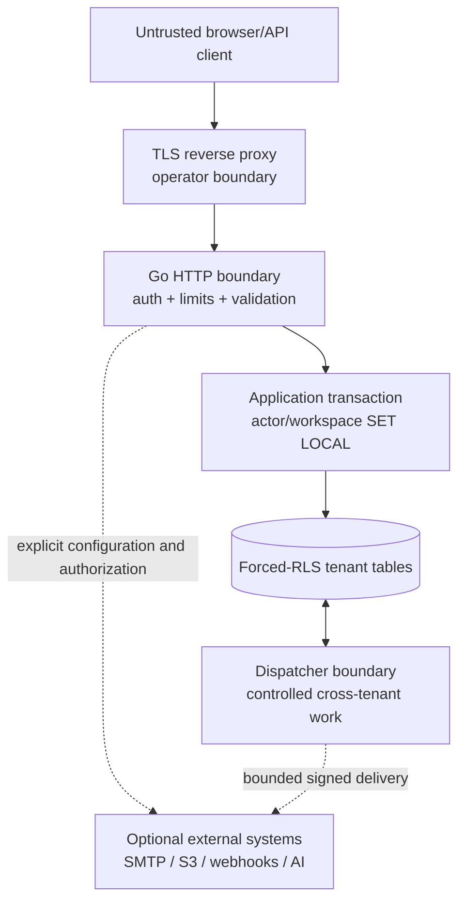

# Threat model

Last reviewed: 2026-07-21  
Scope: base same-origin deployment plus explicitly enabled SMTP, S3-compatible, webhook, and AI adapters.

This document describes intended controls and residual risk. It is not a penetration-test report, compliance attestation, or guarantee. Successful verification commands belong in [`STATE.md`](STATE.md); private vulnerability reporting is described in [`../SECURITY.md`](../SECURITY.md).

## Security objectives

1. A user or integration from workspace A cannot read, search, mutate, export, subscribe to, or infer workspace B data.
2. Passwords, session tokens, MFA material, recovery codes, API keys, webhook secrets, and storage credentials are not exposed in database rows, logs, browser storage, or error responses beyond their intended lifecycle.
3. Mutations are authenticated, authorized, CSRF-protected where cookie-authenticated, validated, idempotent where replay can duplicate effects, and auditable.
4. Background work and real-time delivery preserve tenant context, bounded resource use, retry integrity, and event ordering/idempotency assumptions.
5. Optional integrations cannot silently transmit PII or turn the application into an SSRF, path-traversal, or unbounded-data proxy.
6. Build and release artifacts are traceable to pinned source and dependencies.

## Assets

- Customer PII: names, email, phone, address, notes, activity content, attachments.
- Commercial data: pipeline, deal amount, forecasts, sources, custom fields, reports.
- Identity data: password hashes, MFA secrets, recovery-code hashes, session hashes, invitation/reset material.
- Integration secrets: API-key hashes, webhook secrets, SMTP/S3/AI credentials.
- Authorization state: workspaces, memberships, teams, roles, permissions, disabled state.
- Integrity evidence: audit events, outbox/jobs, automation execution, webhook delivery, search documents.
- Availability: application, PostgreSQL, worker leases, uploads, backups, and SSE clients.
- Translation integrity: stable message keys, placeholder parameters, published workspace content.

## Actors and assumptions

| Actor                     | Capabilities / trust                                                                              |
| ------------------------- | ------------------------------------------------------------------------------------------------- |
| Anonymous internet client | Can reach public HTTP endpoints through the deployment proxy                                      |
| Authenticated member      | Legitimate session and one or more workspace roles; may be malicious                              |
| Workspace owner/admin     | Can configure members/integrations/content inside owned workspace, but not another tenant or host |
| API client                | Holds a scoped key and can replay/modify its own traffic                                          |
| Webhook receiver          | Receives tenant events and may be slow, malicious, or compromised                                 |
| Database runtime role     | Non-superuser, no RLS bypass; trusted only for granted operations                                 |
| Dispatcher/worker         | Cross-tenant coordination path with narrow work-table grants; security-sensitive                  |
| Deployment operator       | Controls environment, database admin, TLS/proxy, volumes, backups, and optional providers         |
| Dependency/build attacker | Attempts lockfile, CI, registry, image, or generated-code compromise                              |

Assumptions:

- TLS terminates at a correctly configured trusted proxy; production cookies and HSTS are enabled only under HTTPS.
- Operators replace development credentials, disable demo seed, protect `.env`, and restrict database/network access.
- PostgreSQL itself, host kernel, container runtime, DNS, SMTP/S3/AI endpoints, and backup storage are patched and administratively controlled.
- Users do not share accounts or export secrets into CRM text fields.

## Trust boundaries

The dispatcher role is a critical boundary: it needs enough global visibility to claim work, but must not become a general request path or expose payloads to arbitrary actors.

## Threats, controls, and residual risk

| Threat                                               | Intended controls / evidence surface                                                                                                | Residual risk or required verification                                                                                             |
| ---------------------------------------------------- | ----------------------------------------------------------------------------------------------------------------------------------- | ---------------------------------------------------------------------------------------------------------------------------------- |
| Cross-tenant object access / IDOR                    | Membership and permission guards; object authorization; tenant IDs; forced RLS; non-bypass runtime role; negative integration tests | New tables/routes can omit guards or policy; schema invariant and read/update/delete/search/export tests must remain release gates |
| Pooled connection leaks tenant context               | `SET LOCAL` only inside transaction; commit/rollback clears settings; pool-leak negative test                                       | A query outside the wrapper or privileged role use can bypass the invariant                                                        |
| RLS policy/role misconfiguration                     | NOLOGIN owners, `veltrix_app` NOBYPASSRLS, narrow dispatcher/search grants, migration review, pre-readiness PostgreSQL bootstrap    | PostgreSQL owner/superuser bypasses RLS; database-container credentials remain an operator deployment boundary                     |
| Privilege escalation through membership/role changes | Permission matrix, owner/admin-only routes, immutable actor/workspace binding, audit                                                | Full authorization-matrix integration coverage and last-owner invariants require continual review                                  |
| Password cracking                                    | Argon2id with bounded parameters, generic auth errors, rate/backoff controls                                                        | Parameters must be benchmarked on deployment hardware; credential stuffing remains possible                                        |
| Session theft/fixation                               | Cryptographic tokens, hash-only storage, rotation, expiry, logout/all, HttpOnly/SameSite/Secure production cookies                  | XSS, compromised endpoint, insecure TLS proxy, or stolen browser profile can still act as user                                     |
| CSRF                                                 | Same-origin default, CSRF cookie/header verification on cookie-authenticated mutations, SameSite                                    | Every mutation route must be classified; verified API-key auth may need a separate non-cookie path                                 |
| MFA bypass/replay                                    | TOTP window/replay step tracking, encrypted MFA secret, single-use hashed recovery codes, bounded challenges                        | Encryption key compromise exposes MFA seeds; recovery/reset flow remains high-value                                                |
| Reset/invitation enumeration or theft                | Generic responses, hashed one-time tokens, expiry, local SMTP profile, rate limits                                                  | Email account compromise and misconfigured SMTP are outside application control                                                    |
| API-key disclosure/over-scope                        | Random secret shown once, hash-only storage, scopes, revoke, last-used metadata                                                     | Scope checks must be enforced per route; logs/proxies must redact Authorization headers                                            |
| SQL injection                                        | Generated/parameterized SQL, bounded validated fields, no dynamic raw value interpolation                                           | Dynamic sort/filter identifiers need allowlists; generated code alone does not validate authorization                              |
| Stored/reflected XSS                                 | Angular escaping, no unsafe HTML, plain-text search snippets, CSP                                                                   | Markdown/HTML features or third-party grid renderers added later require fresh review                                              |
| Malicious translation/content template               | Stable keys, typed placeholders, exact placeholder validation, plain text by default, optimistic publish                            | Rich content must not bypass output encoding; translator role is trusted within tenant                                             |
| CSV formula injection                                | Export cell neutralization and content-disposition safety                                                                           | Spreadsheet behavior varies; imports must stay bounded and validate encodings/columns                                              |
| CSV/import resource exhaustion                       | Preview limits, staged rows, bounded batches/jobs, error report, request limits                                                     | Large files can consume disk/DB; quotas and operator monitoring need deployment tuning                                             |
| Upload path traversal/overwrite                      | Generated object keys, original name only as display metadata, rooted filesystem API, atomic write, MIME/size checks                | MIME sniffing is imperfect; antivirus hook must be wired to a real scanner where required                                          |
| Unauthorized attachment download                     | Workspace transaction/RLS plus entity authorization before stream                                                                   | Signed external object URLs, if added later, need short expiry and tenant binding                                                  |
| S3 credential/data exposure                          | Explicit adapter config, SigV4, HTTPS default, bounded streaming/temp files                                                         | Endpoint trust, bucket policy, encryption, and lifecycle are operator responsibilities                                             |
| Webhook SSRF                                         | URL validation, scheme/host/IP restrictions, redirect policy, timeouts, bounded body, private-network blocking                      | DNS rebinding and proxy behavior require dedicated tests; operator allowlists may be needed                                        |
| Webhook spoof/replay                                 | HMAC timestamp/signature, secret rotation, delivery ID/log, receiver replay guidance                                                | Receiver must validate clock window and deduplicate; secret compromise invalidates assurance                                       |
| Automation recursion/duplicate effects               | Depth limit, execution/action idempotency fences, rate limits, attempt/dead state, safe preview                                     | Complex rule chains can still create business-impact loops; audit and workspace limits are needed                                  |
| Job double execution / lost lease                    | `SKIP LOCKED`, worker ID/lease, handler deadline, idempotent handlers, attempts/backoff/dead state                                  | At-least-once delivery means external side effects require their own idempotency keys                                              |
| Outbox loss                                          | Domain mutation and outbox row in one transaction; durable dispatcher retries                                                       | Poison payloads can block/retry; observability and controlled repair tooling are required                                          |
| SSE cross-tenant leak                                | Authenticated workspace route, RLS replay query, workspace-scoped hub, bounded queues                                               | Reconnect and workspace switching need negative browser/integration tests                                                          |
| SSE/memory denial of service                         | Heartbeat, cancellation cleanup, bounded clients/queues/replay                                                                      | Distributed connection floods need proxy and deployment-level limits                                                               |
| Search data leak or unsafe snippet                   | Narrow NOLOGIN search-function owner; active membership plus entity, stage, audience, and note-visibility checks; plain snippets   | A newly indexed entity needs an explicit authorization branch; stale index deletion still requires trash/merge/delete tests         |
| Chat/call participant disclosure or identity rewrite | Exact active-conversation membership predicates on chats, messages, reactions, pins, and calls; immutable identity triggers       | Media-provider metadata and future membership-management operations require the same participant checks                             |
| Audit tampering or secret logging                    | Append-oriented table, restricted grants, safe summaries, request IDs, structured logging/redaction                                 | DB administrators can modify data; cryptographic append verification is not implemented                                            |
| Brute-force/resource DoS                             | Body/field/rate limits, bounded workers/pools, container PID/memory/CPU limits                                                      | In-process rate state is per replica; edge proxy and multi-replica strategy are operator concerns                                  |
| Optional external AI data exfiltration               | Disabled default, hidden UI without provider, explicit config/PII consent, timeout/cancel/rate/audit                                | Provider retains/processes data under its own terms; prompt injection and output trust remain risks                                |
| Mailbox credential theft / cross-user mail disclosure | AES-256-GCM with account/workspace/user-bound AAD; write-only secrets; actor-scoped forced RLS on every mail table; no admin bypass | A compromised application process or encryption key can decrypt configured accounts; key custody and rotation remain operator duties |
| Mail endpoint SSRF or resource exhaustion             | DNS/IP validation, explicit TLS ports, private-network opt-in, timeouts, bounded connections/pages/messages/MIME/body sizes         | DNS rebinding and provider-specific behavior require continued adversarial testing; corporate private access expands the trust boundary |
| Mail HTML tracking or script injection                | Only bounded plain text is extracted, cached, and returned; remote HTML and active content are never rendered                     | Plain text may still contain malicious links or social-engineering content                                                         |
| Supply-chain compromise                              | Exact lockfiles, pinned image tags, Dependabot, audit/govulncheck/CodeQL/Trivy/SBOM workflows, generated-state checks               | Tags can be mutable and scanners incomplete; digest pinning/provenance/signing are future hardening                                |
| Malicious generated code drift                       | OpenAPI/sqlc generators and clean generated-code CI checks                                                                          | Generator compromise or unreviewed schema semantics remain possible                                                                |
| Backup theft or destructive restore                  | Backup/restore scripts and operator access boundary                                                                                 | Encryption, off-site retention, restore drills, RPO/RTO and key custody are deployment policy                                      |

## Authentication and authorization invariants

- Only a hash of the session token is stored; cookies are never placed in localStorage.
- Production session cookies are `HttpOnly`, `Secure`, and appropriately `SameSite`; cookie names come from central product config.
- Login/reset/API rate limits are bounded and errors do not confirm account existence.
- Disabling a user or logout-all invalidates their active sessions.
- Workspace role is not accepted from request input; it is resolved from membership.
- Object operations validate both workspace and entity ownership.
- API keys carry explicit scopes and workspace identity; a valid but under-scoped key is denied.
- Mailbox account ownership is resolved from the authenticated actor and is never accepted as request input; owner/admin roles do not bypass personal-mail RLS.

## Tenant-isolation verification matrix

For two workspaces and two users, automated real-PostgreSQL tests should prove workspace A cannot:

- list or fetch B's contact/company/lead/deal/activity/notification/audit/attachment;
- find B content through exact, full-text, trigram, saved-view, report, or global-search paths;
- update, move, merge, restore, tag, assign, or delete B objects;
- export B rows or receive them in an import error/report;
- subscribe/replay B SSE events;
- invoke B automation, webhook retry, API-key, translation, membership, or attachment operation;
- exploit a reused pool connection after a committed or rolled-back A transaction;
- insert a tenant-owned row with a mismatched `workspace_id`.

Mailbox tests additionally prove that a second user in the same workspace cannot list, read, update, delete, synchronize, or send through another user's account.

The migration test should also enumerate every table with `workspace_id` and fail if forced RLS or an applicable policy is missing.

## Data minimization and logging

Application logs should use request ID, stable error code, operation, latency, and safe entity identifiers. They must redact passwords, cookie/session/API/MFA/recovery/reset/invitation/webhook/S3/SMTP/IMAP/mailbox/AI secrets; avoid full request/response bodies; and avoid raw mail subjects/bodies/addresses, notes, contact fields, translation text, CSV rows, and attachment names unless a narrowly documented diagnostic mode is active.

Audit events may retain actor, tenant, action, entity, UTC time, request ID, IP/user agent where lawful, and a safe field-level change summary. Audit is not a secret vault.

## Deployment checklist

- Set `APP_ENV=production`, `DEMO_SEED=false`, secure unique DB role passwords, and a random identity encryption key.
- Terminate TLS correctly; enable secure cookies and HSTS only after HTTPS is guaranteed.
- Let the pinned PostgreSQL-derived container complete its finite bootstrap before readiness; never inject administrator credentials, role passwords, automatic-migration flags, or demo credentials into the request-serving process.
- Restrict PostgreSQL and optional service ports to private networks; do not publish MinIO/Ollama/Mailpit in production by default.
- Mount uploads/backups with least privilege, capacity monitoring, and encryption policy.
- Configure reverse-proxy request/rate/connection limits and preserve request IDs without trusting spoofed forwarding headers.
- Run migrations and backup before rollout; exercise restore with synthetic or protected data.
- Review SBOM/scanner output and dependency licenses; verify runtime image contains no Node.js or shell.
- Monitor authentication anomalies, job dead letters, webhook failures, outbox age, DB pool waits, disk/WAL growth, and repeated authorization denials without logging PII.

## Security test and review gates

Required before a stable release:

- unit/integration tests for password/session/MFA/recovery/reset/invitation and full role matrix;
- real-PostgreSQL migration/RLS/tenant-negative tests;
- CSRF/cookie/header/CSP and API-key scope contract tests;
- automation idempotency/recursion/retry and job lease/dead-letter tests;
- webhook signing/replay/SSRF/redirect/secret-rotation tests;
- upload traversal/MIME/size/authz/stream tests;
- SSE auth, replay, slow-client, reconnect, cleanup, and cross-tenant tests;
- `go vet`, `govulncheck`, frontend production audit, static analysis, CodeQL, image scan, and SBOM review;
- independent security review with critical/high findings fixed and affected checks rerun.

Workflow definitions existing in `.github/workflows` do not prove these gates passed. Consult [`STATE.md`](STATE.md) and hosted CI artifacts.

## Explicitly out of scope for the base release

- Protection from a malicious host/database administrator with access to process memory or database superuser credentials.
- End-to-end encryption where the application cannot read CRM content.
- Full anti-malware service, DLP, SIEM, WAF, or enterprise identity federation.
- Guaranteed delivery to or security of an external email, webhook, object store, or AI provider.
- General offline replication/conflict resolution.
- Formal compliance certification or third-party penetration-test attestation.

## Review triggers

Update this threat model when adding a new tenant-owned table, auth method, rich-text renderer, external provider, public share link, signed URL, import format, database role/grant, worker job type, webhook redirect behavior, browser persistence, or multi-node topology. Any RLS policy or identity encryption change requires a focused security review.
